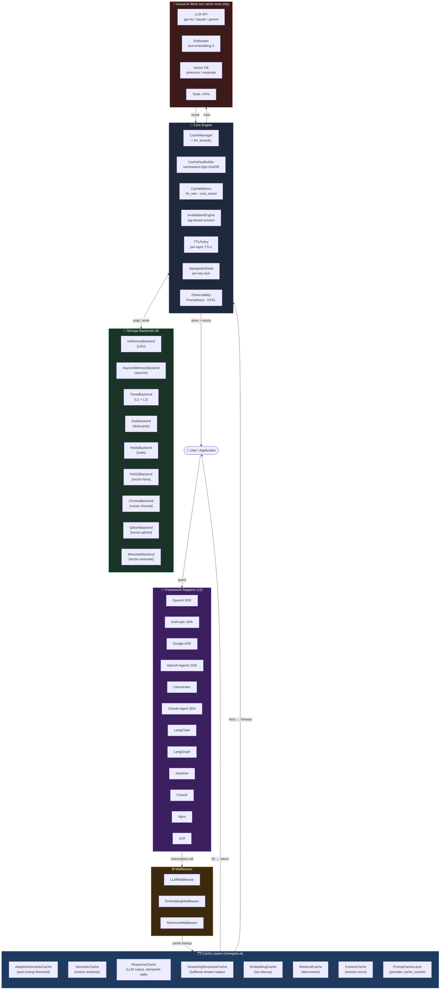
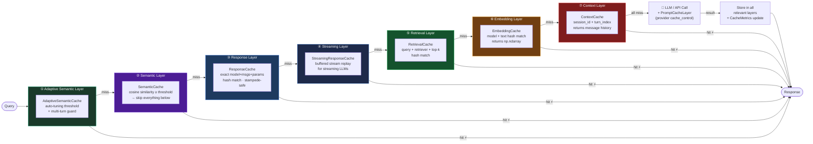
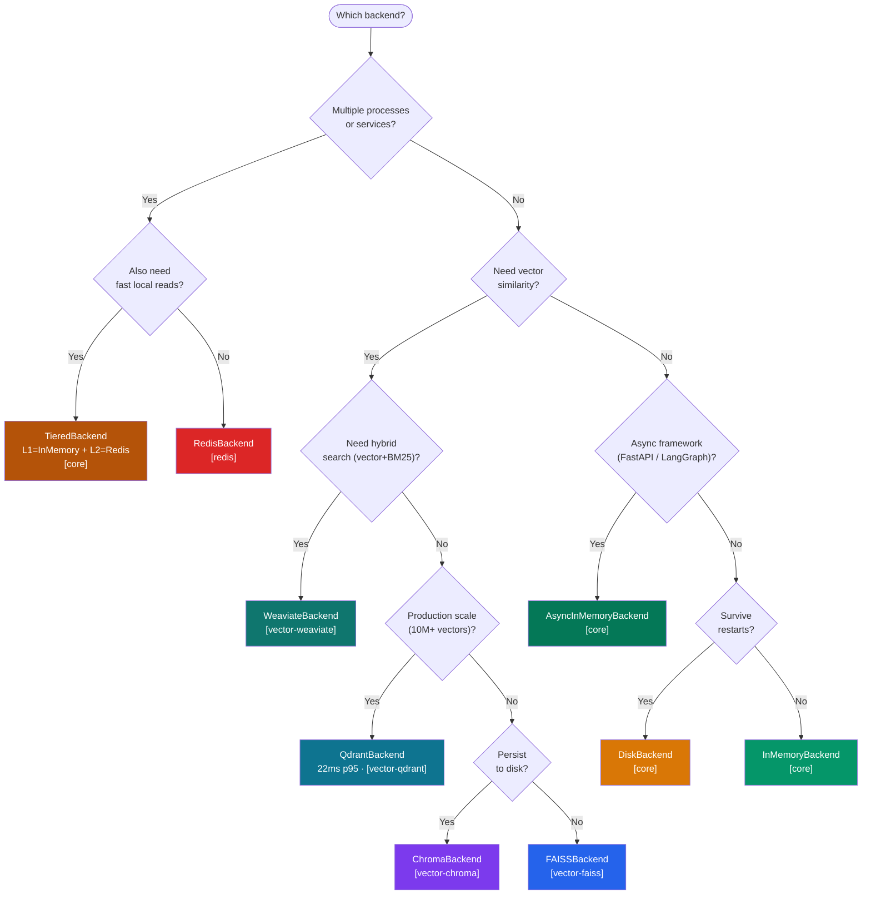

<div align="center">
  

<h1>Chengeta AI</h1>

<p><strong>Persistent Memory for Intelligent Agents.</strong><br/>
  A high-performance memory layer that sits in front of every LLM call, embedding,<br/>
  retrieval query, and agent workflow — so your agents <em>remember</em> instead of recompute.</p>

[](https://pypi.org/project/chengeta-ai/)
[](https://www.python.org/)
[](https://github.com/vigilancetrent/chengeta-ai/actions/workflows/ci.yml)
[](LICENSE)
[](https://pepy.tech/projects/chengeta-ai)
[](https://python.langchain.com/)
[](https://langchain-ai.github.io/langgraph/)
[](https://microsoft.github.io/autogen/)
[](https://www.crewai.com/)
[](https://www.agno.com/)

</div>

> **Chengeta** — _chiShona_ verb, **ku-chengeta**: *to store, to preserve, to protect, to keep safe.*
> That is precisely the job of a memory layer: keep what your agents have already learned, and never pay to learn it twice.

---

## Table of Contents

- [Why Chengeta AI?](#why-chengeta-ai)
- [vs. GPTCache / LiteLLM / redis-vl](#vs-gptcache--litellm--redis-vl)
- [Key Features](#key-features)
- [AI Agent Pipeline Architecture](#ai-agent-pipeline-architecture)
- [Installation](#installation)
- [Quick Start](#quick-start)
- [Cache Layers](#cache-layers)
- [Middleware](#middleware-decorator-pattern)
- [Framework Adapters](#framework-adapters)
- [Backends](#backends)
- [Tag-Based Invalidation](#tag-based-invalidation)
- [Custom Backend](#custom-backend)
- [Project Structure](#project-structure)
- [Development](#development)

---

## Why Chengeta AI?

Agentic systems are expensive because they are forgetful. The same question gets re-asked, the same
document gets re-embedded, the same retrieval gets re-run, and the same tokens get re-billed — on every
turn, every session, every deploy. **Chengeta AI gives your agents a memory that persists**, so work done
once is never paid for twice.

| Forgetful agent                                 | Agent with Chengeta AI                            |
| ----------------------------------------------- | ------------------------------------------------- |
| Every LLM call billed at full token cost        | Identical prompts returned instantly, zero tokens |
| Embeddings re-computed on every request         | Vectors preserved and reused across sessions      |
| Vector search re-run for the same queries       | Retrieval results kept by query + top-k           |
| Agent state lost between runs                   | Session context held across turns and restarts    |
| Semantically identical questions treated as new | Cosine-similarity match recalls the saved answer  |

**One drop-in layer.** Wrap a callable, register an adapter, or point a framework at Chengeta — it works
across LangChain, LangGraph, CrewAI, AutoGen, Agno, A2A, OpenAI, Anthropic, Gemini, LlamaIndex and more,
without changing a single call signature.

---

## vs. GPTCache / LiteLLM / redis-vl

**GPTCache** (8k ⭐) was the closest open-source effort in this space — but it has been effectively unmaintained since 2024. Chengeta AI picks up where it left off with a far more complete, modern, and actively maintained memory layer.

| Feature | Chengeta AI | GPTCache | LiteLLM | redis-vl |
|---|---|---|---|---|
| 13 framework adapters | ✅ | 3 | 1 (gateway) | ❌ |
| Adaptive semantic threshold | ✅ | ❌ | ❌ | ❌ |
| Streaming cache | ✅ | ❌ | ❌ | ❌ |
| Tiered backend (L1 + L2) | ✅ | ❌ | ❌ | ❌ |
| Stampede protection | ✅ | ❌ | ❌ | ❌ |
| Provider prompt cache tracking | ✅ | ❌ | partial | ❌ |
| Qdrant + Weaviate backends | ✅ | ❌ | ❌ | ❌ |
| Prometheus + OTEL export | ✅ | ❌ | ✅ | ❌ |
| Multi-tenant namespacing | ✅ | ❌ | ❌ | ❌ |
| Actively maintained (2026) | ✅ | ❌ dead | ✅ | ✅ |

**LiteLLM** is a gateway/proxy (a different problem domain). **redis-vl** is Redis-only with no framework adapters. Chengeta AI is purpose-built memory infrastructure for agentic systems — broad framework coverage, multiple cache layers, and production-grade backends in one package.

---

## Key Features

### Cache Layers

| Layer             | Class                    | What it caches                                                       | Serialization  |
| ----------------- | ------------------------ | -------------------------------------------------------------------- | -------------- |
| LLM Response      | `ResponseCache`          | Model output keyed by model + messages + params                      | pluggable      |
| Embeddings        | `EmbeddingCache`         | `np.ndarray` vectors keyed by model + text                           | `np.tobytes()` |
| Retrieval         | `RetrievalCache`         | Document lists keyed by query + retriever + top-k                    | pluggable      |
| Context/Session   | `ContextCache`           | Conversation turns keyed by session ID + turn index                  | pluggable      |
| Semantic          | `SemanticCache`          | Answers reused for semantically similar queries (cosine ≥ threshold) | pluggable      |
| Adaptive Semantic | `AdaptiveSemanticCache`  | SemanticCache + auto-tuning threshold + multi-turn guard             | pluggable      |
| Streaming         | `StreamingResponseCache` | Buffers streamed LLM chunks; replays from cache as generator         | pluggable      |
| Prompt Cache      | `PromptCacheLayer`       | Injects Anthropic `cache_control`; tracks provider cache savings     | —              |

### Storage Backends

| Backend              | Class                 | Extras              | Best For                             |
| -------------------- | --------------------- | ------------------- | ------------------------------------ |
| In-Memory (LRU)      | `InMemoryBackend`     | — (core)            | Dev, testing, single-process         |
| Async In-Memory      | `AsyncInMemoryBackend`| — (core)            | FastAPI, async frameworks            |
| Disk                 | `DiskBackend`         | — (core)            | Persistent, single-machine           |
| Redis                | `RedisBackend`        | `[redis]`           | Shared across processes / services   |
| Tiered (L1 + L2)     | `TieredBackend`       | — (core)            | Memory speed + Redis persistence     |
| FAISS                | `FAISSBackend`        | `[vector-faiss]`    | High-speed in-process vector search  |
| ChromaDB             | `ChromaBackend`       | `[vector-chroma]`   | Persistent vector store + metadata   |
| Qdrant               | `QdrantBackend`       | `[vector-qdrant]`   | Fastest production vector DB (22ms)  |
| Weaviate             | `WeaviateBackend`     | `[vector-weaviate]` | Native hybrid search (vector + BM25) |

### Framework Adapters

| Framework             | Class                        | Hook Point                                           | Async                             |
| --------------------- | ---------------------------- | ---------------------------------------------------- | --------------------------------- |
| OpenAI SDK            | `OpenAICacheAdapter`         | `client.chat.completions.create`                     | ✅`achat_create`                  |
| Anthropic SDK         | `AnthropicCacheAdapter`      | `client.messages.create`                             | ✅`amessages_create`              |
| Google ADK            | `GoogleADKCacheAdapter`      | `Agent.run()` / `run_async()`                        | ✅`arun`                          |
| OpenAI Agents SDK     | `OpenAIAgentsCacheAdapter`   | `Runner.run()` / `run_sync()`                        | ✅`arun`                          |
| LlamaIndex LLM        | `LlamaIndexLLMCacheAdapter`  | `complete()` / `chat()` / async variants             | ✅`acomplete` / `achat`           |
| LlamaIndex QueryEngine| `LlamaIndexQueryCacheAdapter`| `query()` / `aquery()`                               | ✅`aquery`                        |
| Claude Agent SDK      | `ClaudeAgentCacheAdapter`    | `claude_code_sdk.query()` async generator            | ✅ (async generator)              |
| LangChain ≥ 0.2       | `LangChainCacheAdapter`      | `BaseCache` — `lookup` / `update`                    | ✅`alookup` / `aupdate`           |
| LangGraph ≥ 0.1 / 1.x | `LangGraphCacheAdapter`      | `BaseCheckpointSaver` — `get_tuple` / `put` / `list` | ✅`aget_tuple` / `aput` / `alist` |
| AutoGen ≥ 0.4         | `AutoGenCacheAdapter`        | `AssistantAgent.run()` / `arun()`                    | ✅`arun`                          |
| AutoGen 0.2.x         | `AutoGenCacheAdapter`        | `ConversableAgent.generate_reply()`                  | —                                 |
| CrewAI ≥ 0.28         | `CrewAICacheAdapter`         | `Crew.kickoff()`                                     | ✅`kickoff_async`                 |
| Agno ≥ 0.1            | `AgnoCacheAdapter`           | `Agent.run()` / `arun()`                             | ✅`arun`                          |
| A2A ≥ 0.2             | `A2ACacheAdapter`            | `process()` / `wrap()` decorator                     | ✅`aprocess`                      |

### Middleware

| Class                 | Wraps                         | Async |
| --------------------- | ----------------------------- | ----- |
| `LLMMiddleware`       | Any sync LLM callable         | —     |
| `AsyncLLMMiddleware`  | Any async LLM callable        | ✅    |
| `EmbeddingMiddleware` | Any sync/async embed function | ✅    |
| `RetrieverMiddleware` | Any sync/async retriever      | ✅    |

### Core Engine

| Component        | Class                | Description                                                                    |
| ---------------- | -------------------- | ------------------------------------------------------------------------------ |
| Orchestrator     | `CacheManager`       | Central hub — wires backend, key builder, TTL policy, invalidation             |
| Key Builder      | `CacheKeyBuilder`    | `namespace:type:sha256[:16]` canonical keys                                    |
| Metrics          | `CacheMetrics`       | Hit/miss/eviction counters + provider cache hits + cost saved                  |
| Serializer       | `Serializer`         | Pluggable encode/decode — `PickleSerializer` (default), `JsonSerializer`       |
| Compressor       | `Compressor`         | Optional compression — `GzipCompressor`, `NoopCompressor` (default)           |
| Stampede Shield  | `StampedeShield`     | Per-key `threading.Lock` prevents concurrent duplicate LLM calls               |
| Request Config   | `RequestConfig`      | Per-request TTL / threshold / `skip_cache` overrides                           |
| Cache Warmer     | `CacheWarmer`        | Bulk pre-populate from query lists or CSV files                                |
| TTL Policy       | `TTLPolicy`          | Global + per-layer TTL overrides                                               |
| Eviction         | `EvictionPolicy`     | LRU / TTL-only strategies, wired into `InMemoryBackend`                        |
| Invalidation     | `InvalidationEngine` | Tag-based bulk eviction                                                        |
| Multi-Tenant     | `CacheManager.for_tenant(id)` | Scoped manager with per-tenant key namespacing, shared backend       |
| Settings         | `ChengetaSettings`  | Dataclass + `from_env()` for 12-factor config                                  |
| Prometheus       | `PrometheusExporter` | `/metrics` HTTP endpoint — requires `[observability]`                          |
| OpenTelemetry    | `OpenTelemetryExporter` | Push metrics to OTEL collector — requires `[observability]`                 |

---

## AI Agent Pipeline Architecture

### Where Cache Layers Sit in a Full AI Pipeline



---

### Cache Layer Responsibilities in the Pipeline



---

### Backend Selection by Use Case



---

## Installation

### Requirements

- Python ≥ 3.12
- Core dependencies: `diskcache`, `numpy` (installed automatically)

### pip (PyPI)

```bash
# Minimal — in-memory + disk backends
pip install chengeta-ai

# ── Framework adapters ──────────────────────────────────────────────
pip install 'chengeta-ai[openai]'          # OpenAI SDK adapter
pip install 'chengeta-ai[anthropic]'       # Anthropic SDK adapter
pip install 'chengeta-ai[google-adk]'      # Google ADK adapter
pip install openai-agents                   # OpenAI Agents SDK adapter
pip install 'chengeta-ai[llamaindex]'      # LlamaIndex LLM + QueryEngine adapters
pip install claude-code-sdk                 # Claude Agent SDK adapter
pip install 'chengeta-ai[langchain]'       # LangChain ≥ 0.2
pip install 'chengeta-ai[langgraph]'       # LangGraph ≥ 0.1 / 1.x
pip install 'chengeta-ai[autogen]'         # AutoGen legacy (pyautogen 0.2.x)
pip install 'autogen-agentchat>=0.4'        # AutoGen new API (separate package)
pip install 'chengeta-ai[crewai]'          # CrewAI ≥ 0.28 / 1.x
pip install 'chengeta-ai[agno]'            # Agno ≥ 0.1 / 2.x
pip install 'a2a-sdk>=0.3' chengeta-ai     # A2A SDK ≥ 0.2

# ── Storage backends ────────────────────────────────────────────────
pip install 'chengeta-ai[redis]'           # Redis
pip install 'chengeta-ai[vector-faiss]'    # FAISS vector search
pip install 'chengeta-ai[vector-chroma]'   # ChromaDB vector store
pip install 'chengeta-ai[vector-qdrant]'   # Qdrant (22ms p95, fastest)
pip install 'chengeta-ai[vector-weaviate]' # Weaviate hybrid search

# ── Observability ────────────────────────────────────────────────────
pip install 'chengeta-ai[observability]'   # Prometheus + OpenTelemetry exporters

# ── Common combos ───────────────────────────────────────────────────
pip install 'chengeta-ai[langchain,redis]'
pip install 'chengeta-ai[langgraph,vector-qdrant]'

# ── Everything ──────────────────────────────────────────────────────
pip install 'chengeta-ai[all]'
```

### uv

```bash
uv add chengeta-ai
uv add 'chengeta-ai[langchain,redis]'
uv add 'chengeta-ai[all]'
```

### From source

```bash
git clone https://github.com/vigilancetrent/chengeta-ai.git
cd chengeta-ai
uv sync --dev         # installs all dev + core deps
uv run pytest         # verify install
```

### Verify

```bash
python -c "import chengeta_ai; print(chengeta_ai.__version__)"
# 0.3.0
```

### Environment variable configuration

| Variable                       | Default                    | Values                      |
| ------------------------------ | -------------------------- | --------------------------- |
| `CHENGETA_BACKEND`            | `memory`                   | `memory` · `disk` · `redis` |
| `CHENGETA_REDIS_URL`          | `redis://localhost:6379/0` | Any Redis URL               |
| `CHENGETA_DISK_PATH`          | `/tmp/chengeta`           | Any writable path           |
| `CHENGETA_DEFAULT_TTL`        | `3600`                     | Seconds;`0` = no expiry     |
| `CHENGETA_NAMESPACE`          | `chengeta`                | Key prefix string           |
| `CHENGETA_SEMANTIC_THRESHOLD` | `0.95`                     | Float 0–1                   |
| `CHENGETA_TTL_EMBEDDING`      | `86400`                    | Per-layer override          |
| `CHENGETA_TTL_RETRIEVAL`      | `3600`                     | Per-layer override          |
| `CHENGETA_TTL_CONTEXT`        | `1800`                     | Per-layer override          |
| `CHENGETA_TTL_RESPONSE`       | `600`                      | Per-layer override          |

```bash
export CHENGETA_BACKEND=redis
export CHENGETA_REDIS_URL=redis://localhost:6379/0
export CHENGETA_DEFAULT_TTL=3600
```

```python
from chengeta_ai import CacheManager, ChengetaSettings

manager = CacheManager.from_settings(ChengetaSettings.from_env())
```

---

## Quick Start

```python
from chengeta_ai import CacheManager, InMemoryBackend, CacheKeyBuilder

manager = CacheManager(
    backend=InMemoryBackend(),
    key_builder=CacheKeyBuilder(namespace="myapp"),
)

manager.set("my_key", {"result": 42}, ttl=60)
value = manager.get("my_key")  # {"result": 42}
```

### LangChain in 3 lines

```python
from langchain_core.globals import set_llm_cache
from chengeta_ai import CacheManager, InMemoryBackend, CacheKeyBuilder
from chengeta_ai.adapters.langchain_adapter import LangChainCacheAdapter

set_llm_cache(LangChainCacheAdapter(CacheManager(backend=InMemoryBackend(), key_builder=CacheKeyBuilder())))
# Every ChatOpenAI / ChatAnthropic call is now cached automatically
```

---

## Cache Layers

### LLM Response Cache

Cache the string or dict output of any LLM call, keyed by model + messages + params.

```python
from chengeta_ai import CacheManager, InMemoryBackend, CacheKeyBuilder, ResponseCache

manager = CacheManager(backend=InMemoryBackend(), key_builder=CacheKeyBuilder(namespace="myapp"))
cache = ResponseCache(manager)

messages = [{"role": "user", "content": "What is 2+2?"}]

cache.set(messages, "4", model_id="gpt-4o")
answer = cache.get(messages, model_id="gpt-4o")  # "4"

# get_or_generate — calls generator only on cache miss
def call_llm(msgs):
    return openai_client.chat.completions.create(...).choices[0].message.content

answer = cache.get_or_generate(messages, call_llm, model_id="gpt-4o")
```

### Embedding Cache

```python
from chengeta_ai import EmbeddingCache

emb_cache = EmbeddingCache(manager)

vec = emb_cache.get_or_compute(
    text="Hello world",
    compute_fn=lambda t: embed_model.encode(t),
    model_id="text-embedding-3-small",
)
```

### Retrieval Cache

```python
from chengeta_ai import RetrievalCache

ret_cache = RetrievalCache(manager)

docs = ret_cache.get_or_retrieve(
    query="What is RAG?",
    retrieve_fn=lambda q: vectorstore.similarity_search(q, k=5),
    retriever_id="my-vectorstore",
    top_k=5,
)
```

### Context / Session Cache

```python
from chengeta_ai import ContextCache

ctx_cache = ContextCache(manager)

ctx_cache.set(session_id="user-123", turn_index=0, messages=[...])
history = ctx_cache.get(session_id="user-123", turn_index=0)

ctx_cache.invalidate_session("user-123")  # clear all turns for this session
```

### Semantic Cache

Returns a cached answer for semantically similar queries (cosine ≥ threshold). Requires `pip install 'chengeta-ai[vector-faiss]'`.

```python
from chengeta_ai import SemanticCache
from chengeta_ai.backends.memory_backend import InMemoryBackend
from chengeta_ai.backends.vector_backend import FAISSBackend

sem_cache = SemanticCache(
    exact_backend=InMemoryBackend(),
    vector_backend=FAISSBackend(dim=1536),
    embed_fn=lambda text: embed_model.encode(text),  # returns np.ndarray
    threshold=0.95,
)

sem_cache.set("What is the capital of France?", "Paris")

sem_cache.get("What is the capital of France?")       # "Paris" — exact
sem_cache.get("Which city is the capital of France?") # "Paris" — semantic hit
```

---

## Middleware (Decorator Pattern)

Wrap any sync/async LLM callable without changing its signature.

```python
from chengeta_ai import LLMMiddleware, CacheKeyBuilder, ResponseCache

middleware = LLMMiddleware(response_cache, key_builder, model_id="gpt-4o")

@middleware
def call_llm(messages: list[dict]) -> str:
    return openai_client.chat.completions.create(...).choices[0].message.content

wrapped = middleware(call_llm)  # or wrap an existing callable
```

```python
from chengeta_ai import AsyncLLMMiddleware

@AsyncLLMMiddleware(response_cache, key_builder, model_id="gpt-4o")
async def call_llm_async(messages):
    return await async_client.chat(messages)
```

Same pattern: `EmbeddingMiddleware`, `RetrieverMiddleware`

---

## Framework Adapters

### LangChain

```python
from langchain_core.globals import set_llm_cache
from chengeta_ai.adapters.langchain_adapter import LangChainCacheAdapter

set_llm_cache(LangChainCacheAdapter(manager))

llm = ChatOpenAI(model="gpt-4o")
response = llm.invoke("What is 2+2?")  # cached on second call
```

### LangGraph

Compatible with langgraph ≥ 0.1 and ≥ 1.0 — adapter auto-detects the API version.

```python
from chengeta_ai.adapters.langgraph_adapter import LangGraphCacheAdapter

saver = LangGraphCacheAdapter(manager)
graph = StateGraph(MyState).compile(checkpointer=saver)

result = graph.invoke({"messages": [...]}, config={"configurable": {"thread_id": "t1"}})
```

### AutoGen

```python
# autogen-agentchat 0.4+ (new API)
from autogen_agentchat.agents import AssistantAgent
from chengeta_ai.adapters.autogen_adapter import AutoGenCacheAdapter

agent = AssistantAgent("assistant", model_client=...)
cached = AutoGenCacheAdapter(agent, manager)
result = await cached.arun("What is 2+2?")

# pyautogen 0.2.x (legacy)
from autogen import ConversableAgent
agent = ConversableAgent(name="assistant", llm_config={...})
cached = AutoGenCacheAdapter(agent, manager)
reply = cached.generate_reply(messages=[{"role": "user", "content": "Hi"}])
```

### CrewAI

```python
from crewai import Crew
from chengeta_ai.adapters.crewai_adapter import CrewAICacheAdapter

crew = Crew(agents=[...], tasks=[...])
cached_crew = CrewAICacheAdapter(crew, manager)

result = cached_crew.kickoff(inputs={"topic": "AI trends"})
result = await cached_crew.kickoff_async(inputs={"topic": "AI trends"})
```

### Agno

```python
from agno.agent import Agent
from chengeta_ai.adapters.agno_adapter import AgnoCacheAdapter

agent = Agent(model=..., tools=[...])
cached = AgnoCacheAdapter(agent, manager)

response = cached.run("Summarize the latest AI research")
response = await cached.arun("Summarize the latest AI research")
```

### Google ADK

```python
from google.adk.agents import Agent
from chengeta_ai.adapters.google_adk_adapter import GoogleADKCacheAdapter

agent = Agent(name="research_agent", model="gemini-2.0-flash", instruction="...")
cached = GoogleADKCacheAdapter(agent, manager)

result = cached.run("Summarise the quarterly report")    # live call
result = cached.run("Summarise the quarterly report")    # instant from cache
result = await cached.arun("Async task")
```

### OpenAI Agents SDK

```python
from agents import Agent, Runner
from chengeta_ai.adapters.openai_agents_adapter import OpenAIAgentsCacheAdapter

agent = Agent(name="assistant", instructions="Be concise", model="gpt-4o")
adapter = OpenAIAgentsCacheAdapter(manager)

result = adapter.run(agent, "What is RAG?")
result = await adapter.arun(agent, "What is RAG?")  # async
```

### LlamaIndex

```python
from llama_index.llms.openai import OpenAI
from chengeta_ai.adapters.llamaindex_adapter import (
    LlamaIndexLLMCacheAdapter,
    LlamaIndexQueryCacheAdapter,
)

# LLM cache
cached_llm = LlamaIndexLLMCacheAdapter(OpenAI(model="gpt-4o"), manager)
response = cached_llm.complete("What is vector search?")

# QueryEngine (RAG) cache
engine = index.as_query_engine()
cached_engine = LlamaIndexQueryCacheAdapter(engine, manager)
response = cached_engine.query("What are the key findings?")
```

### Claude Agent SDK

```python
from chengeta_ai.adapters.claude_agent_adapter import ClaudeAgentCacheAdapter

adapter = ClaudeAgentCacheAdapter(manager)

async for msg in adapter.query("Fix the import error in utils.py", options=options):
    print(msg)  # streams on first call, replays from cache on second
```

### OpenAI SDK

```python
import openai
from chengeta_ai.adapters.openai_adapter import OpenAICacheAdapter

client = openai.OpenAI()
adapter = OpenAICacheAdapter(client, manager)

response = adapter.chat_create(
    model="gpt-4o",
    messages=[{"role": "user", "content": "Hello"}],
)
# Second call with identical args returns instantly from cache

# Async
client = openai.AsyncOpenAI()
adapter = OpenAICacheAdapter(client, manager)
response = await adapter.achat_create(model="gpt-4o", messages=[...])
```

### Anthropic SDK

```python
import anthropic
from chengeta_ai.adapters.anthropic_adapter import AnthropicCacheAdapter

client = anthropic.Anthropic()
adapter = AnthropicCacheAdapter(client, manager)

response = adapter.messages_create(
    model="claude-sonnet-4-6",
    max_tokens=1024,
    messages=[{"role": "user", "content": "Hello"}],
)

# Async
client = anthropic.AsyncAnthropic()
adapter = AnthropicCacheAdapter(client, manager)
response = await adapter.amessages_create(model="claude-sonnet-4-6", ...)
```

### A2A (Agent-to-Agent)

```python
from chengeta_ai.adapters.a2a_adapter import A2ACacheAdapter

adapter = A2ACacheAdapter(manager, agent_id="planner")

# Explicit call
result = adapter.process(handler_fn, task_payload)
result = await adapter.aprocess(async_handler, task_payload)

# As a decorator
@adapter.wrap
def handle_task(payload: dict) -> dict:
    return downstream_agent.process(payload)
```

---

## v0.2.0 Features

### Cache Metrics

```python
manager = CacheManager(backend=InMemoryBackend(), key_builder=CacheKeyBuilder())

manager.get("key")          # miss
manager.set("key", "val")
manager.get("key")          # hit

print(manager.metrics.snapshot())
# {'hits': 1, 'misses': 1, 'evictions': 0, 'sets': 1, 'hit_rate': 0.5, 'miss_rate': 0.5}
```

### Pluggable Serializer

```python
from chengeta_ai import JsonSerializer, ResponseCache

# Use JSON instead of pickle (safer for Redis with untrusted data)
cache = ResponseCache(manager, serializer=JsonSerializer())
```

### Stampede Protection

`ResponseCache.get_or_generate()` uses a per-key lock automatically — under concurrency, only one thread calls the LLM; others wait and read from cache.

### Tiered Backend (L1 + L2)

```python
from chengeta_ai import TieredBackend, InMemoryBackend
from chengeta_ai.backends.redis_backend import RedisBackend

backend = TieredBackend(
    l1=InMemoryBackend(max_size=1000),   # fast, local
    l2=RedisBackend(url="redis://..."),  # persistent, shared
    l1_ttl=300,                          # 5-min local copy
)
manager = CacheManager(backend=backend, key_builder=CacheKeyBuilder())
```

### Compression

```python
from chengeta_ai import GzipCompressor, CacheManager

manager = CacheManager(
    backend=InMemoryBackend(),
    key_builder=CacheKeyBuilder(),
    compressor=GzipCompressor(level=6),  # compress all stored bytes
)
```

### Streaming Response Cache

```python
from chengeta_ai import StreamingResponseCache

stream_cache = StreamingResponseCache(manager)

def stream_fn(messages):
    return openai_client.chat.completions.create(
        model="gpt-4o", messages=messages, stream=True
    )

# First call: live stream + buffered to cache
# Second call: replays chunks from cache at full speed
for chunk in stream_cache.get_or_stream(messages, stream_fn, model_id="gpt-4o"):
    print(chunk.choices[0].delta.content or "", end="", flush=True)
```

### Async Backend

```python
from chengeta_ai import AsyncInMemoryBackend

# Use in async frameworks — does not block the event loop
backend = AsyncInMemoryBackend(max_size=10_000)
value = await backend.get("key")
await backend.set("key", "value", ttl=60)
```

---

## Tag-Based Invalidation

```python
from chengeta_ai import InvalidationEngine, InMemoryBackend, CacheManager, CacheKeyBuilder

manager = CacheManager(
    backend=InMemoryBackend(),
    key_builder=CacheKeyBuilder(),
    invalidation_engine=InvalidationEngine(InMemoryBackend()),
)

manager.set("key1", "v1", tags=["model:gpt-4o", "env:prod"])
manager.set("key2", "v2", tags=["model:gpt-4o"])

count = manager.invalidate("model:gpt-4o")  # removes both entries

# ResponseCache / ContextCache tag automatically
from chengeta_ai import ResponseCache, ContextCache
rc = ResponseCache(manager)
rc.invalidate_model("gpt-4o")           # remove all gpt-4o responses

ctx = ContextCache(manager)
ctx.invalidate_session("user-123")      # clear all session turns
```

---

## Backends

| Backend           | Extra             | Use case                               |
| ----------------- | ----------------- | -------------------------------------- |
| `InMemoryBackend` | —                 | Dev, testing, single-process           |
| `DiskBackend`     | —                 | Survives restarts, single-machine      |
| `RedisBackend`    | `[redis]`         | Shared cache across processes/services |
| `FAISSBackend`    | `[vector-faiss]`  | Semantic/vector similarity search      |
| `ChromaBackend`   | `[vector-chroma]` | Persistent vector store with metadata  |

```python
from chengeta_ai.backends.redis_backend import RedisBackend
from chengeta_ai.backends.disk_backend import DiskBackend

manager = CacheManager(backend=RedisBackend(url="redis://localhost:6379/0"), ...)
manager = CacheManager(backend=DiskBackend(path="/var/cache/chengeta"), ...)
```

---

## Custom Backend

Implement the `CacheBackend` Protocol — no inheritance required (structural typing):

```python
from chengeta_ai.backends.base import CacheBackend
from typing import Any

class MyBackend:
    def get(self, key: str) -> Any | None: ...
    def set(self, key: str, value: Any, ttl: int | None = None) -> None: ...
    def delete(self, key: str) -> None: ...
    def exists(self, key: str) -> bool: ...
    def clear(self) -> None: ...
    def close(self) -> None: ...

assert isinstance(MyBackend(), CacheBackend)  # True
```

---

## Project Structure

```
chengeta_ai/
├── __init__.py                   # Public API surface (28 exports)
├── __main__.py                   # CLI: stats | flush | inspect <key>
├── config/
│   └── settings.py               # ChengetaSettings dataclass + from_env()
├── backends/
│   ├── base.py                   # CacheBackend + VectorBackend Protocols
│   ├── async_base.py             # AsyncCacheBackend Protocol
│   ├── memory_backend.py         # InMemoryBackend (LRU, thread-safe, RLock)
│   ├── async_memory_backend.py   # AsyncInMemoryBackend (asyncio.Lock)
│   ├── disk_backend.py           # DiskBackend (diskcache, process-safe)
│   ├── redis_backend.py          # RedisBackend [optional: redis]
│   ├── tiered_backend.py         # TieredBackend (L1 memory + L2 any backend)
│   └── vector_backend.py         # FAISSBackend + ChromaBackend [optional]
├── core/
│   ├── key_builder.py            # namespace:type:sha256[:16] canonical keys
│   ├── metrics.py                # CacheMetrics (hits/misses/evictions/hit_rate)
│   ├── serializer.py             # Serializer protocol, PickleSerializer, JsonSerializer
│   ├── compressor.py             # Compressor protocol, GzipCompressor, NoopCompressor
│   ├── stampede.py               # StampedeShield (per-key threading.Lock)
│   ├── policies.py               # TTLPolicy, EvictionPolicy (wired into InMemoryBackend)
│   ├── invalidation.py           # Tag-based InvalidationEngine
│   └── cache_manager.py          # Central orchestrator + from_settings()
├── layers/
│   ├── embedding_cache.py        # np.ndarray ↔ bytes serialization
│   ├── retrieval_cache.py        # list[Document], pluggable serializer
│   ├── context_cache.py          # session_id + turn_index keyed
│   ├── response_cache.py         # model + messages + params keyed, stampede-safe
│   ├── semantic_cache.py         # exact → vector two-tier lookup
│   └── streaming_cache.py        # StreamingResponseCache (sync + async generators)
├── middleware/
│   ├── llm_middleware.py         # LLMMiddleware + AsyncLLMMiddleware
│   ├── embedding_middleware.py   # EmbeddingMiddleware
│   └── retriever_middleware.py   # RetrieverMiddleware
└── adapters/
    ├── openai_adapter.py         # OpenAICacheAdapter (chat.completions.create)
    ├── anthropic_adapter.py      # AnthropicCacheAdapter (messages.create)
    ├── langchain_adapter.py      # BaseCache (lookup/update/alookup/aupdate)
    ├── langgraph_adapter.py      # BaseCheckpointSaver (get_tuple/put/list + async)
    ├── autogen_adapter.py        # AssistantAgent 0.4+ + ConversableAgent 0.2.x
    ├── crewai_adapter.py         # Crew.kickoff() + kickoff_async()
    ├── agno_adapter.py           # Agent.run() + arun()
    └── a2a_adapter.py            # process() + aprocess() + @wrap
```

---

## Development

```bash
# Clone and install with dev deps
git clone https://github.com/vigilancetrent/chengeta-ai
cd chengeta-ai
uv sync --dev

# Install pre-commit hooks (runs automatically on every commit)
uv run pre-commit install

# Run all tests
uv run pytest

# With coverage report
uv run pytest --cov=chengeta_ai --cov-report=term-missing

# Lint + format + type check (via pre-commit)
uv run pre-commit run --all-files

# Run specific layer tests
uv run pytest tests/layers/ tests/core/ -v

# Run adapter tests (requires optional deps)
uv run pytest tests/adapters/ -v
```

---

## Contributing

We welcome contributions of all kinds — bug fixes, new backends, new adapters, documentation, and performance improvements.

| File | Purpose |
| ---- | ------- |
| [CONTRIBUTING.md](CONTRIBUTING.md) | Full dev setup, coding standards, how to add backends/adapters |
| [CODE_OF_CONDUCT.md](CODE_OF_CONDUCT.md) | Contributor Covenant 2.1 — community standards |
| [.github/ISSUE_TEMPLATE/bug_report.yml](.github/ISSUE_TEMPLATE/bug_report.yml) | Structured bug report with version, backend, reproduction fields |
| [.github/ISSUE_TEMPLATE/feature_request.yml](.github/ISSUE_TEMPLATE/feature_request.yml) | Feature request with area dropdown, motivation, solution fields |
| [.github/pull_request_template.md](.github/pull_request_template.md) | PR checklist: type, changes, tests, breaking changes |

**Quick start for contributors:**

```bash
git clone https://github.com/vigilancetrent/chengeta-ai
cd chengeta-ai
uv sync --dev
uv run pre-commit install
uv run pytest  # all green before you start
```

Open an issue or [Discussion](https://github.com/vigilancetrent/chengeta-ai/discussions) before starting large changes.

---

## License

MIT — see [LICENSE](LICENSE)

---

<div align="center">
  <sub><strong>Chengeta AI</strong> — Persistent Memory for Intelligent Agents.</sub><br/>
  <sub>Built in the open for engineers who build systems that remember.</sub>
</div>
