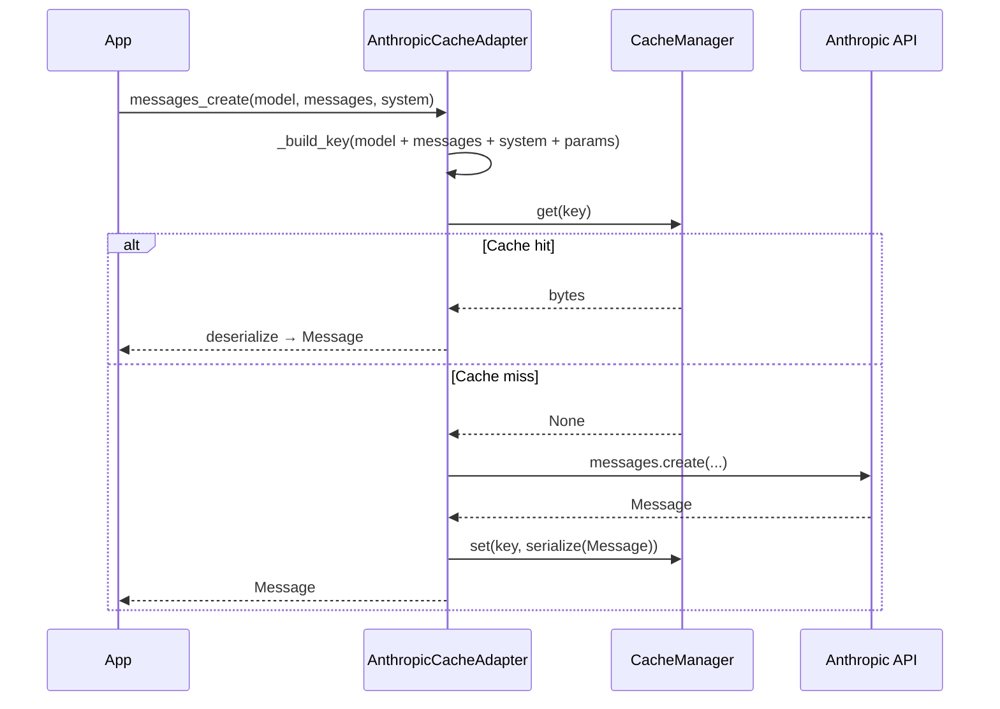

# AnthropicCacheAdapter

Cache Anthropic Claude responses so identical prompts never consume tokens twice.

## Overview

`AnthropicCacheAdapter` wraps the `anthropic.Anthropic` (or `AsyncAnthropic`) client and intercepts calls to `client.messages.create`. The cache key includes model, messages, system prompt, and all generation parameters — so different system prompts produce independent cache entries.

**When to use:**

- Claude-powered pipelines that issue the same prompts repeatedly
- Cost reduction on high-volume inference (Claude Sonnet: $3/M tokens)
- Testing and development where live API calls slow iteration

---

## Installation

```bash
pip install 'chengeta-ai[anthropic]'
```

---

## Usage

### Basic sync caching

```python
import anthropic
from chengeta_ai import CacheManager, InMemoryBackend, CacheKeyBuilder
from chengeta_ai.adapters.anthropic_adapter import AnthropicCacheAdapter

client = anthropic.Anthropic()
manager = CacheManager(backend=InMemoryBackend(), key_builder=CacheKeyBuilder())
adapter = AnthropicCacheAdapter(client, manager)

response = adapter.messages_create(
    model="claude-sonnet-4-6",
    max_tokens=1024,
    messages=[{"role": "user", "content": "What is the capital of France?"}],
)
```

### Async usage

```python
client = anthropic.AsyncAnthropic()
adapter = AnthropicCacheAdapter(client, manager)

response = await adapter.amessages_create(
    model="claude-sonnet-4-6",
    max_tokens=1024,
    messages=[{"role": "user", "content": "Summarise this document."}],
    system="You are a precise summarisation assistant.",
)
```

### Combined with PromptCacheLayer

Combine `AnthropicCacheAdapter` with [`PromptCacheLayer`](../layers/prompt-cache.md) to get both response-level and provider-level caching:

```python
from chengeta_ai.layers.prompt_cache import PromptCacheLayer

layer = PromptCacheLayer(metrics=manager.metrics, min_chars_to_cache=1024)
adapter = AnthropicCacheAdapter(client, manager)

# PromptCacheLayer injects cache_control on long system prompts
response = layer.anthropic_create(
    client,
    model="claude-sonnet-4-6",
    max_tokens=1024,
    system="You are an expert Python engineer. " + " " * 1100,
    messages=[{"role": "user", "content": "Fix the auth bug."}],
)
```

### Tag-based model invalidation

```python
from chengeta_ai.core.invalidation import InvalidationEngine

backend = InMemoryBackend()
manager = CacheManager(
    backend=backend,
    key_builder=CacheKeyBuilder(),
    invalidation_engine=InvalidationEngine(InMemoryBackend()),
)
adapter = AnthropicCacheAdapter(client, manager)

adapter.invalidate_model("claude-sonnet-4-6")  # flush all Sonnet entries
```

!!! note "System prompt is part of the key"
    Changing `system=` produces a new cache entry. This is by design — different system prompts produce different responses.

---

## API Reference

### AnthropicCacheAdapter

**Constructor:**

| Parameter | Type | Default | Description |
|---|---|---|---|
| `client` | `anthropic.Anthropic \| AsyncAnthropic` | *(required)* | Anthropic client instance |
| `manager` | `CacheManager` | *(required)* | Cache manager |

**Methods:**

| Method | Signature | Description |
|---|---|---|
| `messages_create` | `(**kwargs) -> Message` | Cached `client.messages.create` |
| `amessages_create` | `(**kwargs) -> Message` | Async variant |
| `invalidate_model` | `(model: str) -> int` | Remove all cached entries for a model |

---

## How It Works



## Source

:material-file-code: `chengeta_ai/adapters/anthropic_adapter.py`
