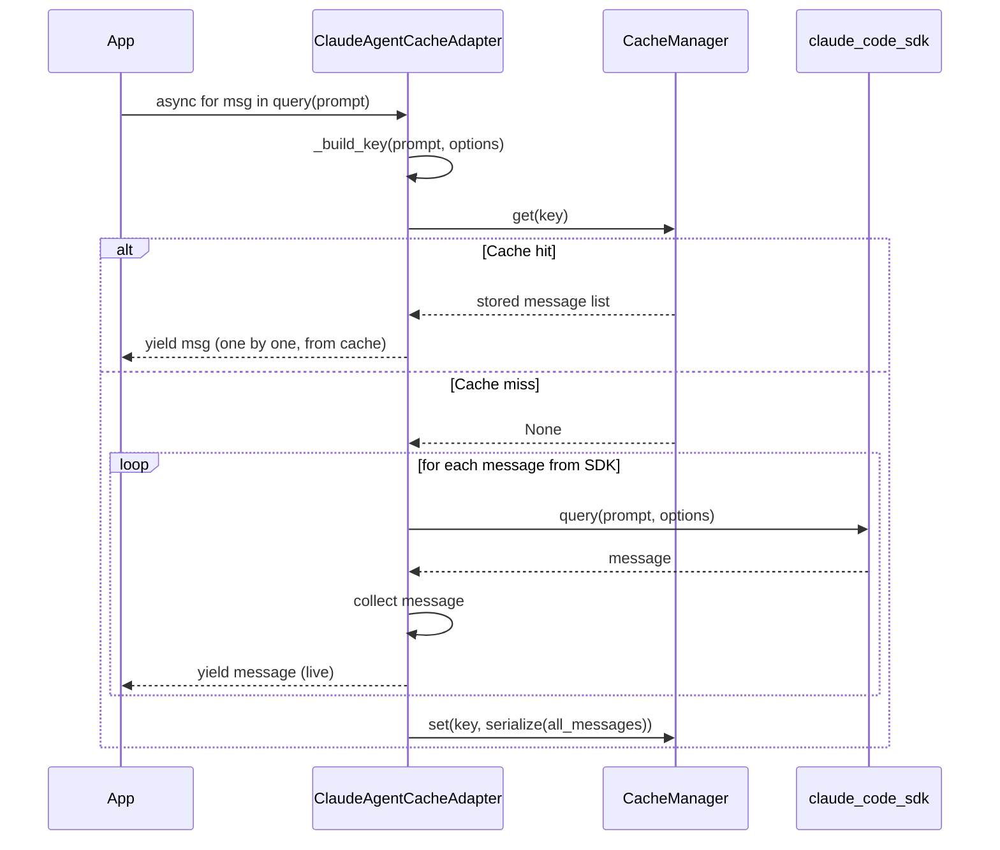

# ClaudeAgentCacheAdapter

Cache Claude Agent SDK `query()` streaming responses so identical prompts replay from cache.

## Overview

`ClaudeAgentCacheAdapter` wraps `claude_code_sdk.query()` — the main entry point for Claude Code agent interactions. Because `query()` is an async generator, the adapter:

1. On **cache miss** — collects all yielded messages, stores the full list, then yields each message in real time
2. On **cache hit** — replays the stored message list as an async generator with zero API latency

The caller always receives an async generator, regardless of cache state.

**When to use:**

- Claude Code agent pipelines run repeatedly on the same prompts
- Evaluation harnesses testing agent behaviour on fixed inputs
- Development/testing without burning API credits on repeated runs

---

## Installation

```bash
pip install claude-code-sdk
pip install chengeta-ai
```

---

## Usage

### Basic caching

```python
from chengeta_ai import CacheManager, InMemoryBackend, CacheKeyBuilder
from chengeta_ai.adapters.claude_agent_adapter import ClaudeAgentCacheAdapter

manager = CacheManager(backend=InMemoryBackend(), key_builder=CacheKeyBuilder())
adapter = ClaudeAgentCacheAdapter(manager)

messages = []
async for msg in adapter.query("Fix the authentication bug in app.py"):
    messages.append(msg)
    print(msg)
```

### With options

```python
from claude_code_sdk import ClaudeCodeOptions

options = ClaudeCodeOptions(max_turns=5, allowed_tools=["Read", "Edit"])

async for msg in adapter.query("Refactor the auth module", options=options):
    process_message(msg)
```

### Disk-backed persistent cache

```python
from chengeta_ai.backends.disk_backend import DiskBackend

manager = CacheManager(
    backend=DiskBackend("/var/cache/claude-agent"),
    key_builder=CacheKeyBuilder(namespace="claude"),
)
adapter = ClaudeAgentCacheAdapter(manager)
```

### Invalidation

```python
adapter.invalidate_all()  # flush all Claude agent cache entries
```

!!! note "Empty results not cached"
    If the async generator yields no messages, the result is not stored. This prevents caching incomplete or errored runs.

!!! warning "Options affect cache key"
    Different `ClaudeCodeOptions` (different allowed tools, max turns, etc.) produce different cache entries. Ensure options are consistent across runs to benefit from caching.

---

## API Reference

### ClaudeAgentCacheAdapter

**Constructor:**

| Parameter | Type | Default | Description |
|---|---|---|---|
| `manager` | `CacheManager` | *(required)* | Cache manager |

**Methods:**

| Method | Signature | Description |
|---|---|---|
| `query` | `(prompt: str, options: Any = None, **kwargs) -> AsyncGenerator` | Cached `claude_code_sdk.query()` |
| `invalidate_all` | `() -> int` | Flush all cached Claude agent responses |

---

## How It Works



## Source

:material-file-code: `chengeta_ai/adapters/claude_agent_adapter.py`
