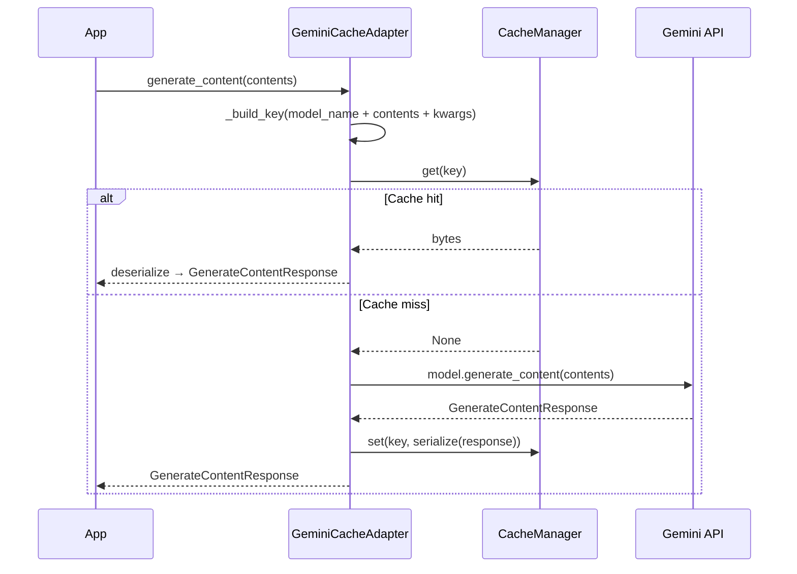

# GeminiCacheAdapter

Cache Google Gemini `generate_content` responses so identical prompts return instantly.

## Overview

`GeminiCacheAdapter` wraps a `google.generativeai.GenerativeModel` instance and intercepts `generate_content` (sync) and `generate_content_async` (async). Cache keys include the model name, content, and all generation kwargs.

**When to use:**

- Gemini-powered pipelines with templated or repeated prompts
- Cost reduction on `gemini-2.0-flash` or `gemini-1.5-pro` workloads
- Zero-change caching — wraps the model object, your call sites stay the same

---

## Installation

```bash
pip install 'chengeta-ai[gemini]'
```

---

## Usage

### Basic sync caching

```python
import google.generativeai as genai
from chengeta_ai import CacheManager, InMemoryBackend, CacheKeyBuilder
from chengeta_ai.adapters.gemini_adapter import GeminiCacheAdapter

genai.configure(api_key="your-api-key")
model = genai.GenerativeModel("gemini-2.0-flash")

manager = CacheManager(backend=InMemoryBackend(), key_builder=CacheKeyBuilder())
adapter = GeminiCacheAdapter(model, manager)

response = adapter.generate_content("What is the capital of France?")
```

### Async usage

```python
response = await adapter.agenerate_content("Summarise the quarterly report.")
```

### Multi-turn content (list input)

```python
contents = [
    {"role": "user", "parts": ["Hello"]},
    {"role": "model", "parts": ["Hi! How can I help?"]},
    {"role": "user", "parts": ["What is 2+2?"]},
]
response = adapter.generate_content(contents)
```

### Shared cache with Redis

```python
from chengeta_ai.backends.redis_backend import RedisBackend

manager = CacheManager(
    backend=RedisBackend(url="redis://localhost:6379/0"),
    key_builder=CacheKeyBuilder(namespace="gemini"),
)
adapter = GeminiCacheAdapter(model, manager)
```

### Model invalidation

```python
from chengeta_ai.core.invalidation import InvalidationEngine

backend = InMemoryBackend()
manager = CacheManager(
    backend=backend,
    key_builder=CacheKeyBuilder(),
    invalidation_engine=InvalidationEngine(InMemoryBackend()),
)
adapter = GeminiCacheAdapter(model, manager)
adapter.invalidate_model()  # flush all entries for this model
```

---

## API Reference

### GeminiCacheAdapter

**Constructor:**

| Parameter | Type | Default | Description |
|---|---|---|---|
| `model` | `genai.GenerativeModel` | *(required)* | Gemini model instance |
| `manager` | `CacheManager` | *(required)* | Cache manager |

**Methods:**

| Method | Signature | Description |
|---|---|---|
| `generate_content` | `(contents: Any, **kwargs) -> GenerateContentResponse` | Cached `model.generate_content` |
| `agenerate_content` | `(contents: Any, **kwargs) -> GenerateContentResponse` | Async via `generate_content_async` |
| `invalidate_model` | `() -> int` | Flush all cached entries for this model |

!!! note "Transparent proxy"
    Any attribute not overridden (e.g. `model.model_name`) is transparently forwarded to the underlying model via `__getattr__`.

---

## How It Works



## Source

:material-file-code: `chengeta_ai/adapters/gemini_adapter.py`
