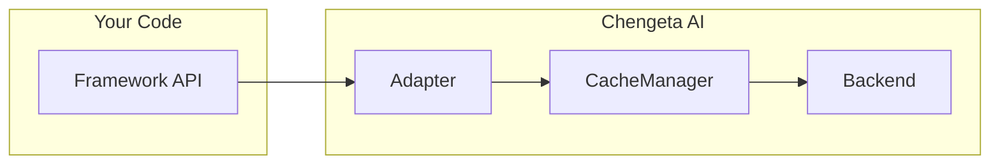

# Adapters

Chengeta AI adapters provide drop-in integrations with popular AI and agent frameworks. Each adapter implements the framework's native cache or agent interface, so you get caching without changing your existing code.

## Overview

Adapters bridge the gap between Chengeta AI's cache engine and the framework-specific APIs that each AI library expects. Instead of writing custom glue code, you instantiate an adapter with a `CacheManager` and plug it into the framework's standard extension point.

There are two adapter styles:

- **Interface adapters** (LangChain, LangGraph) -- subclass the framework's cache/checkpointer base class and implement its required methods. The framework calls these methods automatically.
- **Wrapper adapters** (AutoGen, CrewAI, Agno, A2A) -- wrap an agent or handler with cache logic. All non-overridden attributes proxy through to the original object via `__getattr__`.



---

## Framework Support Matrix

### Provider / SDK Adapters

| Adapter | Provider | Extra | Hook point |
|---|---|---|---|
| [`OpenAICacheAdapter`](openai.md) | OpenAI | `[openai]` | `client.chat.completions.create` |
| [`AnthropicCacheAdapter`](anthropic.md) | Anthropic | `[anthropic]` | `client.messages.create` |
| [`MistralCacheAdapter`](mistral.md) | Mistral AI | `[mistral]` | `client.chat.complete` |
| [`GeminiCacheAdapter`](gemini.md) | Google Gemini | `[gemini]` | `model.generate_content` |

### Agent Framework Adapters

| Adapter | Framework | Min Version | Extra | Interface |
|---|---|---|---|---|
| [`LangChainCacheAdapter`](langchain.md) | LangChain | `langchain-core >= 0.2` | `[langchain]` | `BaseCache` |
| [`LangGraphCacheAdapter`](langgraph.md) | LangGraph | `langgraph >= 0.1` | `[langgraph]` | `BaseCheckpointSaver` |
| [`AutoGenCacheAdapter`](autogen.md) | AutoGen | `pyautogen >= 0.2` or `autogen-agentchat >= 0.4` | `[autogen]` | Agent wrapper |
| [`CrewAICacheAdapter`](crewai.md) | CrewAI | `crewai >= 0.28` | `[crewai]` | Crew wrapper |
| [`AgnoCacheAdapter`](agno.md) | Agno | `agno >= 0.1` | `[agno]` | Agent wrapper |
| [`A2ACacheAdapter`](a2a.md) | A2A / Custom | — | core | Handler / decorator |
| [`LlamaIndexLLMCacheAdapter`](llamaindex.md) | LlamaIndex | `llama-index-core >= 0.10` | `[llamaindex]` | LLM wrapper |
| [`LlamaIndexQueryCacheAdapter`](llamaindex.md) | LlamaIndex | `llama-index-core >= 0.10` | `[llamaindex]` | QueryEngine wrapper |
| [`GoogleADKCacheAdapter`](google-adk.md) | Google ADK | `google-adk >= 0.1` | `[google-adk]` | Agent wrapper |
| [`OpenAIAgentsCacheAdapter`](openai-agents.md) | OpenAI Agents SDK | `openai-agents` | core | Runner wrapper |
| [`ClaudeAgentCacheAdapter`](claude-agent.md) | Claude Agent SDK | `claude-code-sdk` | core | Async generator wrapper |

---

## Quick Start

All adapters follow the same three-step pattern:

```python
from chengeta_ai import CacheManager, InMemoryBackend, CacheKeyBuilder

# 1. Create a CacheManager
manager = CacheManager(
    backend=InMemoryBackend(),
    key_builder=CacheKeyBuilder(namespace="myapp"),
)

# 2. Import the adapter
from chengeta_ai.adapters.langchain_adapter import LangChainCacheAdapter

# 3. Plug it in
adapter = LangChainCacheAdapter(manager)
```

!!! tip
    Install the `all` extra to get every framework dependency at once:
    ```bash
    pip install 'chengeta-ai[all]'
    ```

---

## Adapter Architecture

All wrapper-style adapters (AutoGen, CrewAI, Agno, A2A) implement the **transparent proxy** pattern:

1. Cache-aware methods (`run`, `kickoff`, `process`, etc.) check the cache before delegating to the wrapped object.
2. All other attribute accesses are forwarded to the wrapped object via `__getattr__`, so the adapter behaves identically to the original object for any non-cached operations.

```python
# The adapter acts like the original object
cached_agent = AutoGenCacheAdapter(agent, manager)
cached_agent.name          # proxied to agent.name
cached_agent.run("hello")  # cache-aware
```

---

## Choosing the Right Adapter

| If you use... | Use this adapter | Why |
|---|---|---|
| `openai` Python SDK | [`OpenAICacheAdapter`](openai.md) | Wraps `chat.completions.create` with full async support |
| `anthropic` Python SDK | [`AnthropicCacheAdapter`](anthropic.md) | Wraps `messages.create`; system prompt is part of key |
| `mistralai` Python SDK | [`MistralCacheAdapter`](mistral.md) | Wraps `chat.complete` / `complete_async` |
| `google.generativeai` SDK | [`GeminiCacheAdapter`](gemini.md) | Wraps `generate_content` / `generate_content_async` |
| `langchain` LLMs / chat models | [`LangChainCacheAdapter`](langchain.md) | Implements `BaseCache` -- set globally via `set_llm_cache()` |
| `langgraph` state graphs | [`LangGraphCacheAdapter`](langgraph.md) | Implements `BaseCheckpointSaver` -- pass to `compile(checkpointer=...)` |
| `pyautogen` / `autogen-agentchat` | [`AutoGenCacheAdapter`](autogen.md) | Wraps `generate_reply()` / `run()` / `arun()` |
| `crewai` crews | [`CrewAICacheAdapter`](crewai.md) | Wraps `kickoff()` / `kickoff_async()` |
| `agno` agents | [`AgnoCacheAdapter`](agno.md) | Wraps `run()` / `arun()` |
| Custom A2A / inter-agent messaging | [`A2ACacheAdapter`](a2a.md) | Wraps any handler via `process()` or `@wrap` decorator |
| LlamaIndex LLMs / query engines | [`LlamaIndexLLMCacheAdapter`](llamaindex.md) | Drop-in LLM replacement; streaming bypasses cache |
| Google ADK agents | [`GoogleADKCacheAdapter`](google-adk.md) | Wraps `agent.run()` / `run_async()` |
| OpenAI Agents SDK | [`OpenAIAgentsCacheAdapter`](openai-agents.md) | Wraps `Runner.run_sync` / `Runner.run` |
| Claude Code / Agent SDK | [`ClaudeAgentCacheAdapter`](claude-agent.md) | Caches async generator output; replays on hit |
| Custom LLM functions (no framework) | [Middleware](../middleware/index.md) | Use `LLMMiddleware` or `AsyncLLMMiddleware` directly |

---

## Next Steps

**Provider adapters:** [OpenAI](openai.md) · [Anthropic](anthropic.md) · [Mistral](mistral.md) · [Gemini](gemini.md)

**Framework adapters:** [LangChain](langchain.md) · [LangGraph](langgraph.md) · [AutoGen](autogen.md) · [CrewAI](crewai.md) · [Agno](agno.md) · [A2A](a2a.md) · [LlamaIndex](llamaindex.md) · [Google ADK](google-adk.md) · [OpenAI Agents](openai-agents.md) · [Claude Agent](claude-agent.md)
