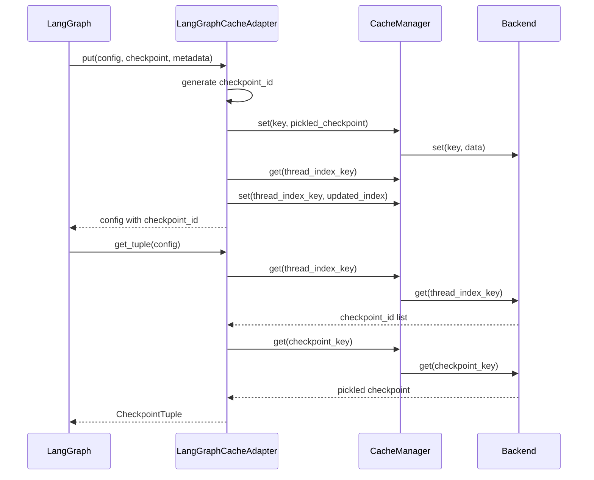

# LangGraphCacheAdapter

Persistent checkpoint storage for LangGraph state graphs. `LangGraphCacheAdapter` implements `BaseCheckpointSaver`, allowing you to persist and restore graph state across runs using any Chengeta AI backend. Compatible with both LangGraph 0.x and 1.x.

## Overview

LangGraph uses a checkpointer to save and restore the state of compiled state graphs between invocations. By implementing `BaseCheckpointSaver`, `LangGraphCacheAdapter` stores checkpoint data in Chengeta AI's backend (in-memory, disk, or Redis), enabling persistent multi-turn conversations, state recovery, and time-travel debugging.

The adapter auto-detects the LangGraph version at import time and adapts its behavior accordingly:

- **LangGraph 0.x** -- Uses `get()`, `put()`, and `list()`.
- **LangGraph 1.x** -- Uses `get_tuple()`, `put()`, `put_writes()`, `list()`, and `get_next_version()`.

**When to use:**

- You are building LangGraph state graphs and need checkpoint persistence.
- You want to share checkpoint storage across multiple graph instances.
- You want to use the same Chengeta AI backend for both LLM caching and graph checkpointing.

---

## Installation

```bash
pip install 'chengeta-ai[langgraph]'
```

This installs `langgraph >= 0.1` and `langchain-core >= 0.2` alongside `chengeta-ai`.

---

## Usage

=== "LangGraph 0.x"

    ```python
    from langgraph.graph import StateGraph, END
    from chengeta_ai import CacheManager, InMemoryBackend, CacheKeyBuilder
    from chengeta_ai.adapters.langgraph_adapter import LangGraphCacheAdapter

    # Set up Chengeta AI
    manager = CacheManager(
        backend=InMemoryBackend(),
        key_builder=CacheKeyBuilder(namespace="myapp"),
    )
    saver = LangGraphCacheAdapter(manager)

    # Define a simple graph
    def agent_node(state):
        return {"messages": state["messages"] + ["Hello!"]}

    graph = StateGraph(dict)
    graph.add_node("agent", agent_node)
    graph.set_entry_point("agent")
    graph.add_edge("agent", END)

    app = graph.compile(checkpointer=saver)

    # Invoke with a thread ID for persistent state
    config = {"configurable": {"thread_id": "user-123"}}
    result = app.invoke({"messages": ["Hi"]}, config=config)

    # State is checkpointed -- restore on next invocation
    result = app.invoke({"messages": ["What did I say?"]}, config=config)
    ```

=== "LangGraph 1.x"

    ```python
    from langgraph.graph import StateGraph, END
    from chengeta_ai import CacheManager, InMemoryBackend, CacheKeyBuilder
    from chengeta_ai.adapters.langgraph_adapter import LangGraphCacheAdapter

    # Same API -- the adapter detects the version automatically
    manager = CacheManager(
        backend=InMemoryBackend(),
        key_builder=CacheKeyBuilder(namespace="myapp"),
    )
    saver = LangGraphCacheAdapter(manager)

    graph = StateGraph(dict)
    graph.add_node("agent", agent_node)
    graph.set_entry_point("agent")
    graph.add_edge("agent", END)

    app = graph.compile(checkpointer=saver)
    config = {"configurable": {"thread_id": "user-456"}}
    result = app.invoke({"messages": ["Hi"]}, config=config)
    ```

### Multi-Thread Conversations

Each `thread_id` maintains its own checkpoint history:

```python
# Thread 1
config_1 = {"configurable": {"thread_id": "alice"}}
app.invoke({"messages": ["I like Python"]}, config=config_1)

# Thread 2 (independent state)
config_2 = {"configurable": {"thread_id": "bob"}}
app.invoke({"messages": ["I like Rust"]}, config=config_2)

# Thread 1 remembers its own state
app.invoke({"messages": ["What do I like?"]}, config=config_1)
```

### Listing Checkpoints

Iterate over saved checkpoints for a thread, most recent first:

```python
config = {"configurable": {"thread_id": "alice"}}

for checkpoint_tuple in saver.list(config, limit=5):
    print(checkpoint_tuple.checkpoint)
    print(checkpoint_tuple.metadata)
```

### Redis-Backed Persistence

Use a Redis backend for cross-process or cross-server checkpoint sharing:

```python
from chengeta_ai.backends.redis_backend import RedisBackend

manager = CacheManager(
    backend=RedisBackend(url="redis://localhost:6379/0"),
    key_builder=CacheKeyBuilder(namespace="prod"),
)
saver = LangGraphCacheAdapter(manager)
```

### Async Usage

The adapter provides async shims that delegate to the synchronous implementations:

```python
# In an async context
tuple_result = await saver.aget_tuple(config)
new_config = await saver.aput(config, checkpoint, metadata)

async for item in saver.alist(config, limit=10):
    print(item)
```

---

## API Reference

### LangGraphCacheAdapter

Subclasses `langgraph.checkpoint.base.BaseCheckpointSaver`.

**Constructor:**

| Parameter | Type | Default | Description |
|---|---|---|---|
| `cache_manager` | `CacheManager` | *(required)* | The Chengeta AI cache manager instance |

**LangGraph 0.x Methods:**

| Method | Signature | Description |
|---|---|---|
| `get` | `(config: dict) -> Any \| None` | Return the raw checkpoint dict for the given config. Returns `None` if no checkpoint exists. |
| `put` | `(config, checkpoint, metadata, new_versions=None) -> dict` | Store a checkpoint and return the updated config with `checkpoint_id` filled in. |
| `list` | `(config, *, filter=None, before=None, limit=None) -> Iterator[CheckpointTuple]` | Yield `CheckpointTuple` objects for the thread, most recent first. |

**LangGraph 1.x Methods:**

| Method | Signature | Description |
|---|---|---|
| `get_tuple` | `(config: dict) -> CheckpointTuple \| None` | Return a `CheckpointTuple` for the given config. If no `checkpoint_id` is specified, returns the latest checkpoint for the thread. |
| `put` | `(config, checkpoint, metadata, new_versions=None) -> dict` | Store a checkpoint. Accepts the `new_versions` parameter (ChannelVersions) required by LangGraph 1.x. |
| `put_writes` | `(config, writes: list[tuple[str, Any]], task_id: str) -> None` | Store intermediate writes for a checkpoint. |
| `get_next_version` | `(current: Any, channel: Any) -> int \| str` | Return the next channel version. Returns `1` for `None`, increments integers, converts strings to int and increments. |

**Async Shims:**

| Method | Signature | Description |
|---|---|---|
| `aget_tuple` | `(config) -> CheckpointTuple \| None` | Async wrapper around `get_tuple()`. |
| `aput` | `(config, checkpoint, metadata, new_versions=None) -> dict` | Async wrapper around `put()`. |
| `aput_writes` | `(config, writes, task_id) -> None` | Async wrapper around `put_writes()`. |
| `alist` | `(config, *, filter=None, before=None, limit=None) -> AsyncIterator` | Async generator that yields from `list()`. |

**Config Structure:**

The `config` dict must contain a `configurable` key with the following optional fields:

| Field | Type | Description |
|---|---|---|
| `thread_id` | `str` | Thread identifier (default: `"default"`) |
| `checkpoint_ns` | `str` | Checkpoint namespace (default: `""`) |
| `checkpoint_id` | `str` | Specific checkpoint ID (default: `""` -- uses latest) |

!!! note
    When `checkpoint_id` is not specified in the config, `get_tuple()` automatically loads the most recent checkpoint for the given `thread_id`. The `put()` method generates a `checkpoint_id` from `time.monotonic_ns()` if one is not provided.

!!! warning
    The async methods (`aget_tuple`, `aput`, `alist`, `aput_writes`) currently delegate to the synchronous implementations. For true async I/O with non-blocking backends, you would need to implement a fully async adapter.

---

## How It Works

Checkpoints are stored as pickled dicts containing `checkpoint`, `metadata`, `parent_config`, `pending_writes`, and `new_versions`. A separate thread index (a pickled list of checkpoint IDs) is maintained per `thread_id` to enable `list()` and latest-checkpoint resolution.


