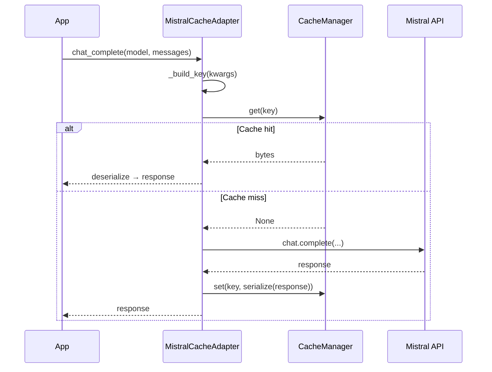

# MistralCacheAdapter

Cache Mistral AI chat completions so identical prompts return instantly without consuming tokens.

## Overview

`MistralCacheAdapter` wraps the `mistralai.Mistral` client and intercepts `client.chat.complete` (sync) and `client.chat.complete_async` (async). Cache keys include model, messages, and all generation parameters.

**When to use:**

- Mistral-powered pipelines with repeated or templated prompts
- Cost reduction on `mistral-large-latest` workloads
- Drop-in caching layer without refactoring existing Mistral code

---

## Installation

```bash
pip install 'chengeta-ai[mistral]'
```

---

## Usage

### Basic sync caching

```python
from mistralai import Mistral
from chengeta_ai import CacheManager, InMemoryBackend, CacheKeyBuilder
from chengeta_ai.adapters.mistral_adapter import MistralCacheAdapter

client = Mistral(api_key="your-api-key")
manager = CacheManager(backend=InMemoryBackend(), key_builder=CacheKeyBuilder())
adapter = MistralCacheAdapter(client, manager)

response = adapter.chat_complete(
    model="mistral-large-latest",
    messages=[{"role": "user", "content": "What is the capital of France?"}],
)
```

### Async usage

```python
response = await adapter.achat_complete(
    model="mistral-large-latest",
    messages=[{"role": "user", "content": "Summarise this report."}],
)
```

### Persistent cache with disk backend

```python
from chengeta_ai.backends.disk_backend import DiskBackend

manager = CacheManager(
    backend=DiskBackend("/var/cache/mistral"),
    key_builder=CacheKeyBuilder(namespace="mistral"),
)
adapter = MistralCacheAdapter(client, manager)
```

### Model invalidation

```python
from chengeta_ai.core.invalidation import InvalidationEngine

backend = InMemoryBackend()
manager = CacheManager(
    backend=backend,
    key_builder=CacheKeyBuilder(),
    invalidation_engine=InvalidationEngine(InMemoryBackend()),
)
adapter = MistralCacheAdapter(client, manager)
adapter.invalidate_model("mistral-large-latest")
```

!!! note "stream excluded from key"
    The `stream` parameter is excluded from cache key computation so streaming and non-streaming requests share the same cache entries.

---

## API Reference

### MistralCacheAdapter

**Constructor:**

| Parameter | Type | Default | Description |
|---|---|---|---|
| `client` | `mistralai.Mistral` | *(required)* | Mistral client instance |
| `manager` | `CacheManager` | *(required)* | Cache manager |

**Methods:**

| Method | Signature | Description |
|---|---|---|
| `chat_complete` | `(**kwargs) -> ChatCompletionResponse` | Cached `client.chat.complete` |
| `achat_complete` | `(**kwargs) -> ChatCompletionResponse` | Async variant via `complete_async` |
| `invalidate_model` | `(model: str) -> int` | Remove all cached entries for a model |

---

## How It Works



## Source

:material-file-code: `chengeta_ai/adapters/mistral_adapter.py`
