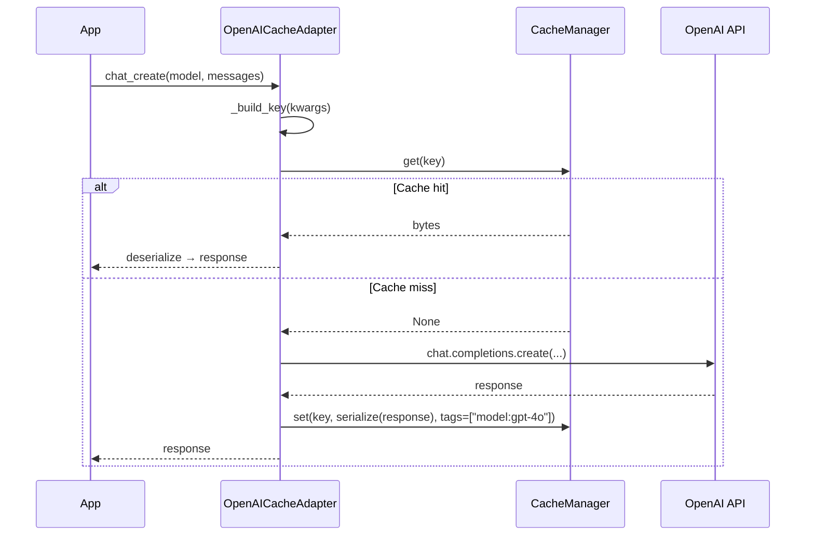

# OpenAICacheAdapter

Cache OpenAI chat completion responses so identical prompts are served instantly without an API call.

## Overview

`OpenAICacheAdapter` wraps the `openai.OpenAI` (or `AsyncOpenAI`) client and intercepts calls to `client.chat.completions.create`. On a cache hit the stored response is returned in under 1ms; on a miss the real API is called and the result stored for future requests.

**When to use:**

- You call the same or similar OpenAI prompts repeatedly (pipelines, batch jobs, testing)
- You want zero-code caching without changing your existing `openai` client setup
- You need async support with a consistent interface

---

## Installation

```bash
pip install 'chengeta-ai[openai]'
```

---

## Usage

### Basic sync caching

```python
import openai
from chengeta_ai import CacheManager, InMemoryBackend, CacheKeyBuilder
from chengeta_ai.adapters.openai_adapter import OpenAICacheAdapter

client = openai.OpenAI()
manager = CacheManager(backend=InMemoryBackend(), key_builder=CacheKeyBuilder())
adapter = OpenAICacheAdapter(client, manager)

# First call — hits OpenAI API
response = adapter.chat_create(
    model="gpt-4o",
    messages=[{"role": "user", "content": "What is the capital of France?"}],
)

# Second call — served from cache (<1ms)
response = adapter.chat_create(
    model="gpt-4o",
    messages=[{"role": "user", "content": "What is the capital of France?"}],
)
```

### Async usage

```python
import openai
from chengeta_ai.adapters.openai_adapter import OpenAICacheAdapter

client = openai.AsyncOpenAI()
adapter = OpenAICacheAdapter(client, manager)

response = await adapter.achat_create(
    model="gpt-4o",
    messages=[{"role": "user", "content": "Hello!"}],
)
```

### With Redis for shared caching

```python
from chengeta_ai.backends.redis_backend import RedisBackend

manager = CacheManager(
    backend=RedisBackend(url="redis://localhost:6379/0"),
    key_builder=CacheKeyBuilder(namespace="openai"),
)
adapter = OpenAICacheAdapter(client, manager)
```

### Tag-based model invalidation

```python
from chengeta_ai.core.invalidation import InvalidationEngine

backend = InMemoryBackend()
manager = CacheManager(
    backend=backend,
    key_builder=CacheKeyBuilder(),
    invalidation_engine=InvalidationEngine(InMemoryBackend()),
)
adapter = OpenAICacheAdapter(client, manager)

# ... populate cache ...

# Invalidate everything cached for gpt-4o
adapter.invalidate_model("gpt-4o")
```

!!! note "Stream parameter excluded from key"
    The `stream` parameter is intentionally excluded from cache key computation. A request with `stream=True` and `stream=False` share the same cache entry.

---

## API Reference

### OpenAICacheAdapter

**Constructor:**

| Parameter | Type | Default | Description |
|---|---|---|---|
| `client` | `openai.OpenAI \| AsyncOpenAI` | *(required)* | OpenAI client instance |
| `manager` | `CacheManager` | *(required)* | Cache manager |

**Methods:**

| Method | Signature | Description |
|---|---|---|
| `chat_create` | `(**kwargs) -> ChatCompletion` | Cached `client.chat.completions.create` |
| `achat_create` | `(**kwargs) -> ChatCompletion` | Async variant |
| `invalidate_model` | `(model: str) -> int` | Remove all cached entries for a model |

!!! warning "Pickle serialization"
    Responses are pickled by default. If using a shared backend (Redis), ensure all clients use compatible Python/openai-sdk versions.

---

## How It Works



## Source

:material-file-code: `chengeta_ai/adapters/openai_adapter.py`
