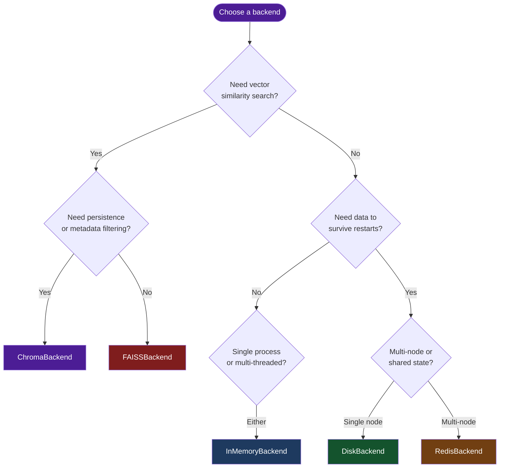

# Storage Backends

Chengeta AI provides five interchangeable storage backends -- three for key-value caching and two for vector similarity search. Every backend conforms to a `Protocol`, so you can swap implementations without changing application code.

## Overview

Backends are the persistence layer beneath every cache layer. Choosing the right one depends on your durability requirements, latency budget, deployment topology, and whether you need exact-match or semantic-similarity lookups.

Chengeta AI defines two protocols in `chengeta_ai.backends.base`:

- **`CacheBackend`** -- key-value storage with optional TTL (implemented by InMemoryBackend, DiskBackend, RedisBackend).
- **`VectorBackend`** -- vector similarity search over embedding spaces (implemented by FAISSBackend, ChromaBackend).

Both protocols are `@runtime_checkable`, so you can verify conformance with `isinstance()`.

## Decision Flowchart

Use the diagram below to pick the right backend for your workload.



## Comparison Table

### Key-Value Backends (CacheBackend)

| Feature | InMemory | AsyncInMemory | Disk | Redis | Tiered |
|---|---|---|---|---|---|
| **Persistence** | None | None | Disk | Redis | L2 backend |
| **Async native** | No | Yes | No | No | No |
| **Multi-process** | No | No | Yes | Yes | Depends on L2 |
| **Multi-node** | No | No | No | Yes | Depends on L2 |
| **TTL support** | Yes | Yes | Yes | Yes | Yes |
| **Eviction** | LRU | LRU | Size-based | Server policy | L1: LRU |
| **Extra** | core | core | core | `[redis]` | core |
| **Latency** | ~µs | ~µs | ~ms | ~ms (network) | L1: ~µs |

### Vector Backends (VectorBackend)

| Feature | FAISS | Chroma | Qdrant | Weaviate | Pinecone |
|---|---|---|---|---|---|
| **Similarity metric** | Cosine | Cosine | Cosine | Cosine | Cosine |
| **Persistence** | None | Optional | Optional | Cloud/local | Serverless |
| **Deletion support** | Soft | Native | Native | Native | Native |
| **Metadata filtering** | No | Yes | Yes | Yes | Yes |
| **Hybrid search** | No | No | No | Yes | No |
| **Cloud-managed** | No | No | Yes | Yes | Yes |
| **Extra** | `[vector-faiss]` | `[vector-chroma]` | `[vector-qdrant]` | `[vector-weaviate]` | `[vector-pinecone]` |
| **Best for** | In-process, dev | Persistent local | Production scale | Hybrid search | Serverless cloud |

## Protocols

### CacheBackend Protocol

```python
from chengeta_ai.backends.base import CacheBackend

# Methods every key-value backend must implement:
# get(key: str) -> Any | None
# set(key: str, value: Any, ttl: int | None = None) -> None
# delete(key: str) -> None
# exists(key: str) -> bool
# clear() -> None
# close() -> None
```

### VectorBackend Protocol

```python
from chengeta_ai.backends.base import VectorBackend

# Methods every vector backend must implement:
# add(key: str, vector: np.ndarray, metadata: dict[str, Any]) -> None
# search(vector: np.ndarray, top_k: int = 1) -> list[tuple[str, float]]
# delete(key: str) -> None
# clear() -> None
# close() -> None
```

!!! tip "Runtime protocol checking"
    Both protocols are decorated with `@runtime_checkable`, so you can write
    `isinstance(my_backend, CacheBackend)` to verify at runtime that an object
    conforms to the expected interface.

## Backend Pages

**Key-value:**

- [InMemoryBackend](memory.md) -- Thread-safe LRU cache with TTL
- [AsyncInMemoryBackend](async-memory.md) -- Async-native LRU for async frameworks
- [DiskBackend](disk.md) -- Persistent disk cache via diskcache
- [RedisBackend](redis.md) -- Distributed cache via Redis
- [TieredBackend](tiered.md) -- L1 (memory) + L2 (any backend) two-tier caching

**Vector similarity:**

- [FAISSBackend](faiss.md) -- Fast in-process vector search
- [ChromaBackend](chroma.md) -- Persistent vector store with metadata
- [QdrantBackend](qdrant.md) -- Production vector DB (22ms p95 at 10M vectors)
- [WeaviateBackend](weaviate.md) -- Native hybrid search (vector + BM25)
- [PineconeBackend](pinecone.md) -- Serverless managed vector search
