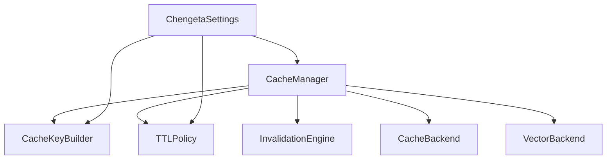

# Core Module

The core module is the foundation of Chengeta AI. It contains the central orchestrator, key generation logic, TTL and eviction policies, tag-based invalidation, and the unified settings object that ties everything together.

---

## Overview

Every caching operation in Chengeta AI flows through the core module. Whether you are caching LLM responses, embeddings, retrieval results, or agent context, the core module provides the primitives that make it work:

- **CacheManager** -- the single entry point for all cache reads, writes, and invalidations.
- **CacheKeyBuilder** -- deterministic, namespaced key generation with content hashing.
- **TTLPolicy / EvictionPolicy** -- fine-grained control over expiration and eviction.
- **InvalidationEngine** -- tag-based bulk invalidation of related cache entries.
- **ChengetaSettings** -- a dataclass that centralizes every configuration knob, loadable from code or environment variables.

---

## Architecture



The `CacheManager` wires together a backend, key builder, TTL policy, and optional vector backend. The `ChengetaSettings` dataclass feeds configuration into the factory method `CacheManager.from_settings()`, which selects and instantiates the correct components automatically.

---

## Components

| Component | Module | Description |
|---|---|---|
| [CacheManager](cache-manager.md) | `chengeta_ai.core.cache_manager` | Central orchestrator for all cache operations |
| [CacheKeyBuilder](key-builder.md) | `chengeta_ai.core.key_builder` | Deterministic namespaced key generation |
| [TTLPolicy](policies.md#ttlpolicy) | `chengeta_ai.core.policies` | Per-type TTL configuration |
| [EvictionPolicy](policies.md#evictionpolicy) | `chengeta_ai.core.policies` | Eviction strategy configuration |
| [InvalidationEngine](invalidation.md) | `chengeta_ai.core.invalidation` | Tag-based cache invalidation |
| [ChengetaSettings](settings.md) | `chengeta_ai.config.settings` | Unified configuration dataclass |

---

## Quick Example

```python
from chengeta_ai import CacheManager, ChengetaSettings

# One-line setup from environment variables
manager = CacheManager.from_settings(ChengetaSettings.from_env())

# Build a key and cache a value
key = manager.key_builder.build("response", {"prompt": "Hello, world!"})
manager.set(key, "Hi there!", tags=["greetings"])

# Retrieve
value = manager.get(key)

# Invalidate all entries tagged "greetings"
removed = manager.invalidate("greetings")
```

---

## Next Steps

- [CacheManager](cache-manager.md) -- Start here to understand the central API
- [Configuration](../getting-started/configuration.md) -- All settings and environment variables
- [Quick Start](../getting-started/quickstart.md) -- End-to-end walkthrough
