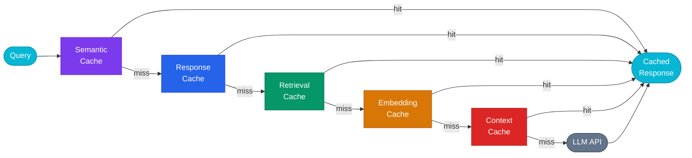

---
hide:
  - navigation
  - toc
---

<!-- Hero Section -->
<div class="hero-section">
<div class="hero-badge">
  <span class="badge-dot"></span> Open Source — MIT Licensed
</div>
<h1 class="hero-title">
  Memory Infrastructure<br>
  for <span class="gradient-text">Agentic AI</span>
</h1>
<p class="hero-subtitle">
  Chengeta AI gives intelligent agents a persistent, high-performance memory layer across
  frameworks, workflows, and environments — so they recall what they have already done
  instead of paying to recompute it.
</p>
<div class="hero-actions">
  <a href="getting-started/quickstart/" class="hero-btn hero-btn-primary">Get Started →</a>
  <a href="getting-started/installation/" class="hero-btn hero-btn-secondary">View Documentation</a>
  <a href="https://github.com/vigilancetrent/chengeta-ai" class="hero-btn hero-btn-secondary">GitHub</a>
</div>
<div class="hero-install">
  <span class="prompt">$</span> pip install chengeta-ai
</div>
</div>

<!-- Stats -->
<div class="stats-bar">
  <div class="stat-item">
    <div class="stat-number">8</div>
    <div class="stat-label">Memory Layers</div>
  </div>
  <div class="stat-item">
    <div class="stat-number">9</div>
    <div class="stat-label">Backends</div>
  </div>
  <div class="stat-item">
    <div class="stat-number">13+</div>
    <div class="stat-label">Adapters</div>
  </div>
  <div class="stat-item">
    <div class="stat-number">40+</div>
    <div class="stat-label">Recipes</div>
  </div>
</div>

<hr class="section-divider">

## Why Chengeta AI?

<div class="grid cards" markdown>

-   :material-layers-triple-outline:{ .lg .middle } **5 Cache Layers**

    ---

    Response, Embedding, Retrieval, Context, and Semantic cache layers — each optimized for its data type and serialization format.

    [:octicons-arrow-right-24: Explore layers](layers/index.md)

-   :material-database-outline:{ .lg .middle } **5 Storage Backends**

    ---

    In-Memory LRU, Disk, Redis, FAISS, and ChromaDB. Pick the backend that matches your scale and persistence needs.

    [:octicons-arrow-right-24: See backends](backends/index.md)

-   :material-puzzle-outline:{ .lg .middle } **6 Framework Adapters**

    ---

    LangChain, LangGraph, AutoGen, CrewAI, Agno, and A2A. Drop-in integration with zero code changes to your existing pipeline.

    [:octicons-arrow-right-24: View adapters](adapters/index.md)

-   :material-brain:{ .lg .middle } **Semantic Cache**

    ---

    Returns cached answers for semantically similar queries using cosine similarity — not just exact string matches.

    [:octicons-arrow-right-24: Learn more](layers/semantic.md)

-   :material-tag-multiple-outline:{ .lg .middle } **Tag-Based Invalidation**

    ---

    Tag cache entries by model, session, or deployment. Invalidate thousands of related keys with a single call.

    [:octicons-arrow-right-24: See invalidation](core/invalidation.md)

-   :material-timer-outline:{ .lg .middle } **Smart TTL Policies**

    ---

    Configure time-to-live per cache type. Embeddings last 24h, responses 10min. Customize everything via env vars.

    [:octicons-arrow-right-24: Configure TTL](core/policies.md)

</div>

<hr class="section-divider">

## Supported Frameworks

<div class="framework-row">
  <span class="framework-badge">LangChain</span>
  <span class="framework-badge">LangGraph</span>
  <span class="framework-badge">AutoGen</span>
  <span class="framework-badge">CrewAI</span>
  <span class="framework-badge">Agno</span>
  <span class="framework-badge">A2A</span>
</div>

<hr class="section-divider">

## Quick Example

```python
from chengeta_ai import CacheManager, InMemoryBackend, CacheKeyBuilder

# Create a cache manager in 3 lines
manager = CacheManager(
    backend=InMemoryBackend(),
    key_builder=CacheKeyBuilder(namespace="myapp"),
)

# Cache any value with optional TTL
manager.set("my_key", {"result": "data"}, ttl=60)
value = manager.get("my_key")  # {"result": "data"}
```

<hr class="section-divider">

## Pipeline Architecture

<div class="pipeline-wrapper">



</div>

<hr class="section-divider">

## Without vs. With Chengeta AI

| Without Caching | With Chengeta AI |
|---|---|
| Every LLM call billed at full token cost | Identical prompts returned instantly, **zero tokens** |
| Embeddings re-computed on every request | Vectors stored and **reused across sessions** |
| Vector search re-run for same queries | Retrieval results **cached by query + top_k** |
| Agent state lost between runs | Session context **persisted across turns** |
| Similar questions treated as unique | Cosine similarity returns **cached answer** |

<hr class="section-divider">

## Get Started

<div class="grid cards" markdown>

-   :material-download-outline:{ .lg .middle } **Installation**

    ---

    Install via pip, uv, or from GitHub

    [:octicons-arrow-right-24: Install now](getting-started/installation.md)

-   :material-rocket-launch-outline:{ .lg .middle } **Quick Start**

    ---

    Your first cache in 30 seconds

    [:octicons-arrow-right-24: Get started](getting-started/quickstart.md)

-   :material-book-open-outline:{ .lg .middle } **Cookbook**

    ---

    40+ runnable recipes for every framework

    [:octicons-arrow-right-24: Browse recipes](cookbook/index.md)

-   :material-code-tags:{ .lg .middle } **API Reference**

    ---

    Complete class and method documentation

    [:octicons-arrow-right-24: View API](api-reference/index.md)

</div>
