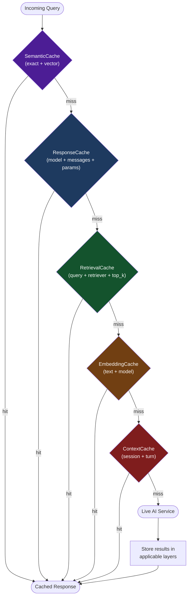

# Cache Layers

Chengeta AI ships five purpose-built cache layers. Each layer targets a distinct stage of the AI pipeline, uses optimized serialization for its data type, and exposes a consistent `get` / `set` / `get_or_*` interface backed by a shared `CacheManager`.

---

## At a Glance

| Layer | Class | What it caches | Key Components | Serialization |
|---|---|---|---|---|
| [Response](response.md) | `ResponseCache` | LLM completions (any object) | model ID + messages hash + params hash | `pickle` |
| [Embedding](embedding.md) | `EmbeddingCache` | Dense float32 vectors (`np.ndarray`) | text + model ID | `tobytes` / `frombuffer` |
| [Retrieval](retrieval.md) | `RetrievalCache` | Document lists from retrievers | query + retriever ID + top_k | `pickle` |
| [Context](context.md) | `ContextCache` | Conversation message history | session ID + turn index | `pickle` |
| [Semantic](semantic.md) | `SemanticCache` | Any value, matched by meaning | exact key **or** cosine similarity | `pickle` |
| [Adaptive Semantic](adaptive-semantic.md) | `AdaptiveSemanticCache` | Extends SemanticCache with self-tuning threshold | cosine similarity + multi-turn guard | `pickle` |
| [Streaming](streaming-response.md) | `StreamingResponseCache` | Streamed LLM chunks buffered and replayed | messages + model + params | `pickle` |
| [Prompt Cache](prompt-cache.md) | `PromptCacheLayer` | Provider-level prefix caching (Anthropic/OpenAI) | Injects `cache_control`; tracks savings | — |

---

## Pipeline Diagram

The layers form a cascading pipeline. A query enters at the top and falls through each layer until a cache hit is found or the live service is called.



!!! tip "You do not need every layer"
    Each layer is independent. Use only the layers relevant to your workload. A simple chatbot may need only `ResponseCache`, while a full RAG agent benefits from all five.

---

## Shared Design Principles

All cache layers follow a common contract:

1. **Constructor takes a `CacheManager`** (except `SemanticCache`, which wires its own backends directly).
2. **`get(...)` returns `None` on miss** -- never raises on a cache miss.
3. **`set(...)` accepts an optional `ttl`** -- when omitted, the `TTLPolicy` on the manager decides.
4. **`get_or_*` convenience methods** combine lookup and computation in a single call, ensuring the result is stored before it is returned.
5. **Keys are built via `CacheKeyBuilder`** -- deterministic, namespaced, and hash-truncated for readability.

---

## How Layers Relate to Backends

```
+-----------------+       +-----------------+
|  Cache Layer    | ----> |  CacheManager   |
|  (ResponseCache,|       |                 |
|   EmbeddingCache |       |  backend        | ---> InMemory / Disk / Redis
|   etc.)         |       |  vector_backend | ---> FAISS / Chroma
|                 |       |  key_builder    |
+-----------------+       |  ttl_policy     |
                          |  invalidation   |
                          +-----------------+
```

Layers never talk to a backend directly. They delegate to `CacheManager`, which resolves TTL, builds keys, and routes to the appropriate storage backend.

!!! note "SemanticCache is the exception"
    `SemanticCache` accepts an `exact_backend` and a `vector_backend` directly, bypassing `CacheManager`. This gives it full control over the two-tier lookup flow.

---

## Quick Setup

```python
from chengeta_ai import CacheManager, InMemoryBackend, CacheKeyBuilder
from chengeta_ai.layers.response_cache import ResponseCache
from chengeta_ai.layers.embedding_cache import EmbeddingCache
from chengeta_ai.layers.retrieval_cache import RetrievalCache
from chengeta_ai.layers.context_cache import ContextCache

manager = CacheManager(
    backend=InMemoryBackend(),
    key_builder=CacheKeyBuilder(namespace="myapp"),
)

response_cache  = ResponseCache(manager)
embedding_cache = EmbeddingCache(manager, dim=1536)
retrieval_cache = RetrievalCache(manager)
context_cache   = ContextCache(manager)
```

For `SemanticCache`, see the dedicated [SemanticCache page](semantic.md).

---

## Next Steps

- [ResponseCache](response.md) -- cache LLM completions
- [EmbeddingCache](embedding.md) -- cache dense vectors
- [RetrievalCache](retrieval.md) -- cache retriever results
- [ContextCache](context.md) -- cache conversation history
- [SemanticCache](semantic.md) -- meaning-aware caching (the core differentiator)
- [AdaptiveSemanticCache](adaptive-semantic.md) -- self-tuning threshold for production
- [StreamingResponseCache](streaming-response.md) -- cache streaming LLM responses
- [PromptCacheLayer](prompt-cache.md) -- provider-level prefix caching + savings tracking
