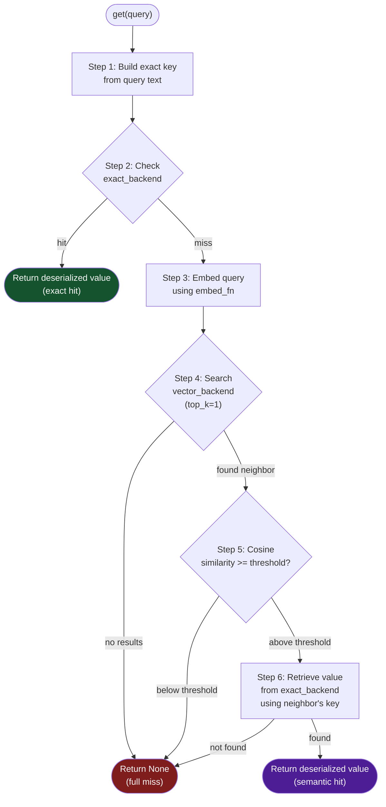

# SemanticCache

The core differentiator of Chengeta AI. Returns cached answers for queries that _mean_ the same thing, even when the wording is different.

---

## Overview

`SemanticCache` is a two-tier cache that combines exact key lookup with vector cosine similarity search. When a user asks "What is the capital of France?" and a cached answer already exists for "Capital of France?", the semantic cache recognizes these as equivalent and returns the stored result -- no LLM call required.

**What it caches:** Any picklable Python object (strings, dicts, Pydantic models, full LLM response objects).

**How it works:** Exact match first (fast, zero-cost), then vector similarity fallback (requires an embedding call).

**When to use:** Any user-facing system where the same questions are asked in many different phrasings -- customer support bots, FAQ systems, search assistants, or any workload with high query redundancy.

!!! tip "Threshold tuning"
    The default threshold of `0.95` is conservative -- it requires very high similarity. Lower it to `0.90` for broader matching at the cost of occasional false positives. For safety-critical applications, keep it at `0.95` or above.

---

## Usage

### Setup

`SemanticCache` accepts backends directly rather than a `CacheManager`. You provide:

- An **exact backend** (any `CacheBackend` -- InMemory, Disk, Redis) for fast key-value lookups.
- A **vector backend** (any `VectorBackend` -- FAISS, Chroma) for approximate nearest-neighbor search.
- An **embed function** that converts query strings to numpy float32 vectors.

```python
import numpy as np
from chengeta_ai.backends.memory_backend import InMemoryBackend
from chengeta_ai.backends.vector_backend import FAISSBackend
from chengeta_ai.layers.semantic_cache import SemanticCache

def embed(text: str) -> np.ndarray:
    """Replace with your real embedding function."""
    response = openai.embeddings.create(
        model="text-embedding-3-small", input=text
    )
    return np.array(response.data[0].embedding, dtype=np.float32)

cache = SemanticCache(
    exact_backend=InMemoryBackend(),
    vector_backend=FAISSBackend(dim=1536),
    embed_fn=embed,
    threshold=0.95,
)
```

### Store and retrieve

```python
# Store a response
cache.set("What is the capital of France?", "The capital of France is Paris.")

# Exact match -- instant, no embedding call
result = cache.get("What is the capital of France?")
print(result)  # "The capital of France is Paris."

# Semantic match -- embeds the query, finds the nearest neighbor
result = cache.get("Capital of France?")
print(result)  # "The capital of France is Paris."  (if similarity >= threshold)

# No match
result = cache.get("What is the population of Tokyo?")
print(result)  # None
```

### Delete and clear

```python
# Remove a specific query
cache.delete("What is the capital of France?")

# Flush both backends entirely
cache.clear()
```

---

## How It Works -- The 6-Step Lookup Flow

When `get(query)` is called, the cache executes the following steps:



### Step-by-step detail

1. **Build exact key.** The query string is passed to `CacheKeyBuilder.build("response", query)`, producing a deterministic key like `chengeta:resp:a3f9b2c1d4e5f678`.

2. **Check exact backend.** The key is looked up in `exact_backend.get(key)`. If found, the raw bytes are deserialized with `pickle.loads` and returned immediately. This path requires no embedding computation and is the fastest possible cache hit.

3. **Embed the query.** On exact miss, the query is passed to `embed_fn(query)`, which returns a float32 numpy array. This typically requires an API call to an embedding model.

4. **Search the vector backend.** The embedding is sent to `vector_backend.search(vector, top_k=1)`, which returns the nearest stored vector along with its similarity score and associated key.

5. **Check similarity threshold.** If the cosine similarity between the query embedding and the nearest neighbor is greater than or equal to `threshold` (default `0.95`), the match is accepted. Otherwise, the lookup is a full miss.

6. **Retrieve the value.** The key associated with the nearest neighbor is used to look up the stored value in `exact_backend`. If found, it is deserialized and returned as a semantic hit. If the key has expired or been evicted, the result is `None`.

!!! note "The vector backend stores keys, not values"
    The vector backend maps embeddings to cache keys. The actual cached value is always stored in and retrieved from the exact backend. This keeps the vector index lightweight and ensures TTL expiration in the exact backend is respected.

---

## Storage Flow

When `set(query, value)` is called:

1. Build the exact key from the query string.
2. Serialize the value with `pickle.dumps` and store it in `exact_backend` with the optional TTL.
3. Embed the query using `embed_fn`.
4. Add the embedding and key to `vector_backend` via `vector_backend.add(key, vector, metadata)`.

```python
# Internally:
key = key_builder.build("response", query)        # "chengeta:resp:..."
exact_backend.set(key, pickle.dumps(value), ttl)   # store the value
vector = embed_fn(query).astype(np.float32)         # embed the query
vector_backend.add(key, vector, {"value": value})   # index the vector
```

---

## API Reference

### Constructor

| Parameter | Type | Default | Description |
|---|---|---|---|
| `exact_backend` | `CacheBackend` | *required* | Backend for exact key-value lookups (InMemory, Disk, or Redis). |
| `vector_backend` | `VectorBackend` | *required* | Backend for approximate nearest-neighbor search (FAISS or Chroma). |
| `embed_fn` | `Callable[[str], np.ndarray]` | *required* | Function that converts a query string to a float32 numpy vector. |
| `threshold` | `float` | `0.95` | Minimum cosine similarity to accept a semantic match. Range: 0.0 to 1.0. |
| `key_builder` | `CacheKeyBuilder \| None` | `None` | Optional key builder. If `None`, a default `CacheKeyBuilder()` is created. |

### Methods

| Method | Parameters | Returns | Description |
|---|---|---|---|
| `get` | `query: str` | `Any \| None` | Look up by exact key, then by vector similarity. Returns `None` on full miss. |
| `set` | `query: str`, `value: Any`, `ttl: int \| None = None` | `None` | Store the value in both exact and vector backends. |
| `delete` | `query: str` | `None` | Remove the query from both backends. |
| `clear` | *(none)* | `None` | Flush all entries from both backends. |

---

## Threshold Guidelines

| Threshold | Behavior | Recommended for |
|---|---|---|
| `0.98 - 1.00` | Near-exact matches only | Safety-critical, medical, legal |
| `0.95` (default) | High similarity required | General production use |
| `0.90 - 0.94` | Moderate flexibility | FAQ bots, search assistants |
| `< 0.90` | Broad matching | Exploratory, non-critical workloads |

!!! warning "Low thresholds increase false positives"
    A threshold below `0.90` may match queries that are topically related but semantically distinct. For example, "How to train a dog" might match "How to train a neural network" at low thresholds. Always validate with representative query pairs before deploying a low threshold in production.

---

## Comparison with ResponseCache

| Feature | ResponseCache | SemanticCache |
|---|---|---|
| Match type | Exact (hash-based) | Exact + vector similarity |
| Requires embedding model | No | Yes |
| Catches rephrasings | No | Yes |
| Latency on miss | Negligible | One embedding call |
| Backend requirement | `CacheManager` | `CacheBackend` + `VectorBackend` |

Use `ResponseCache` when prompts are programmatic and identical across calls. Use `SemanticCache` when queries come from humans and vary in phrasing.

---

## Source

:material-file-code: `chengeta_ai/layers/semantic_cache.py`
