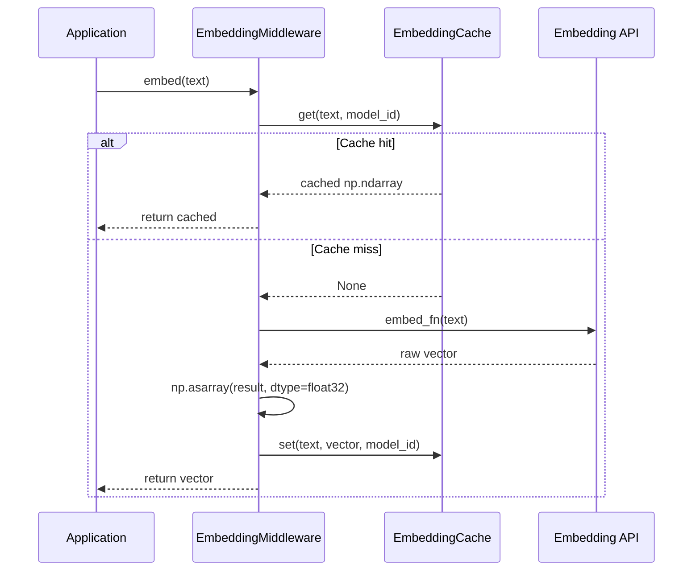

# EmbeddingMiddleware

Intercept any embedding callable with transparent vector caching. Wrap your embedding function once and every subsequent call with the same input text returns the cached `numpy.float32` array instantly, avoiding redundant embedding API calls.

## Overview

`EmbeddingMiddleware` wraps an embedding callable with `EmbeddingCache` lookups. It auto-detects whether the wrapped function is synchronous or asynchronous and produces the appropriate wrapper. Results are automatically converted to `numpy.float32` arrays before storage, ensuring consistent vector types regardless of what the underlying function returns.

**When to use:**

- You have a custom embedding function that you want to cache (e.g., a direct OpenAI `embeddings.create` call).
- You want to avoid paying for the same text to be embedded repeatedly.
- You need model-aware cache keys so that embeddings from different models are stored separately.

---

## Installation

No additional dependencies are required beyond the base `chengeta-ai` package (which includes `numpy`).

```bash
pip install chengeta-ai
```

---

## Usage

### Synchronous Embedding Caching

=== "Decorator"

    ```python
    from chengeta_ai import (
        CacheManager, InMemoryBackend, CacheKeyBuilder, EmbeddingCache,
    )
    from chengeta_ai.middleware.embedding_middleware import EmbeddingMiddleware

    manager = CacheManager(
        backend=InMemoryBackend(),
        key_builder=CacheKeyBuilder(namespace="myapp"),
    )
    embedding_cache = EmbeddingCache(manager, dim=1536)

    middleware = EmbeddingMiddleware(
        embedding_cache=embedding_cache,
        model_id="text-embedding-ada-002",
    )

    @middleware
    def embed(text: str):
        import openai
        client = openai.OpenAI()
        response = client.embeddings.create(
            model="text-embedding-ada-002", input=text
        )
        return response.data[0].embedding

    # First call hits the API
    vector = embed("What is machine learning?")

    # Second call returns from cache
    vector = embed("What is machine learning?")
    print(vector.dtype)  # float32
    ```

=== "Explicit wrapping"

    ```python
    def raw_embed(text: str):
        import openai
        client = openai.OpenAI()
        response = client.embeddings.create(
            model="text-embedding-ada-002", input=text
        )
        return response.data[0].embedding

    cached_embed = middleware(raw_embed)
    vector = cached_embed("What is deep learning?")
    ```

### Async Embedding Caching

```python
@middleware
async def embed_async(text: str):
    import openai
    client = openai.AsyncOpenAI()
    response = await client.embeddings.create(
        model="text-embedding-ada-002", input=text
    )
    return response.data[0].embedding

# In an async context
vector = await embed_async("What is NLP?")
```

!!! tip
    `EmbeddingMiddleware` auto-detects coroutine functions. You do not need a separate async middleware class -- use the same `EmbeddingMiddleware` instance for both sync and async functions.

### Multiple Embedding Models

```python
ada_middleware = EmbeddingMiddleware(
    embedding_cache=embedding_cache,
    model_id="text-embedding-ada-002",
)

cohere_middleware = EmbeddingMiddleware(
    embedding_cache=embedding_cache,
    model_id="embed-english-v3.0",
)

@ada_middleware
def embed_openai(text: str):
    ...

@cohere_middleware
def embed_cohere(text: str):
    ...
```

### Batch Processing

While `EmbeddingMiddleware` wraps a single-text callable, you can use it in a loop to cache individual texts from a batch:

```python
texts = [
    "Introduction to neural networks",
    "Deep learning fundamentals",
    "Introduction to neural networks",  # cache hit
]

vectors = [embed(text) for text in texts]
# Only 2 API calls are made; the third is served from cache
```

---

## API Reference

### EmbeddingMiddleware

**Constructor:**

| Parameter | Type | Default | Description |
|---|---|---|---|
| `embedding_cache` | `EmbeddingCache` | *(required)* | The embedding cache layer instance |
| `model_id` | `str` | `"default"` | Model identifier used as a key discriminator |

**Methods:**

| Method | Signature | Description |
|---|---|---|
| `__call__` | `(embed_fn: Callable[[str], Any]) -> Callable[[str], np.ndarray]` | Wraps `embed_fn` with cache lookup/store logic. Auto-detects sync vs async. Returns `numpy.float32` arrays. |
| `decorate` | `(fn: Callable[[str], Any]) -> Callable[[str], np.ndarray]` | Alias for `__call__`. |

!!! note
    The returned wrapper always produces `numpy.float32` arrays. If the original function returns a Python list, a raw numpy array of a different dtype, or any other array-like object, it is automatically converted via `numpy.asarray(..., dtype=numpy.float32)`.

---

## How It Works



!!! warning
    `EmbeddingMiddleware` delegates cache reads and writes to the synchronous `EmbeddingCache.get()` and `EmbeddingCache.set()` methods, even when wrapping an async function. The async wrapper only awaits the embedding call itself.
