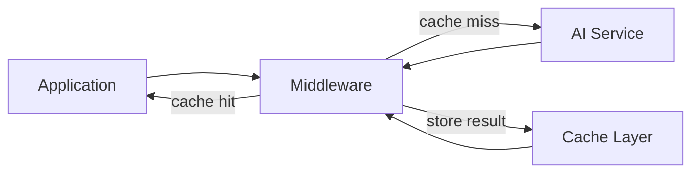

# Middleware

Chengeta AI middleware components use the decorator pattern to intercept LLM, embedding, and retriever calls, transparently adding cache lookup and storage around your existing functions with zero changes to calling code.

## Overview

Middleware sits between your application logic and the underlying AI service call. Each middleware class is a callable that wraps a function: on invocation, it checks the cache first and only calls the original function on a cache miss. The result is then stored for future lookups.

All middleware classes support both **decorator syntax** (`@middleware`) and **explicit wrapping** (`middleware(fn)`). Each class auto-detects whether the wrapped function is synchronous or asynchronous and generates the correct wrapper.



---

## Comparison Table

| Middleware | Cache Layer | Key Discriminators | Sync | Async | Decorator |
|---|---|---|---|---|---|
| [`LLMMiddleware`](llm.md) | `ResponseCache` | messages, model_id | Yes | -- | `@middleware` |
| [`AsyncLLMMiddleware`](llm.md#asyncllmmiddleware) | `ResponseCache` | messages, model_id | Yes | Yes | `@middleware` |
| [`EmbeddingMiddleware`](embedding.md) | `EmbeddingCache` | text, model_id | Yes | Yes | `@middleware` |
| [`RetrieverMiddleware`](retriever.md) | `RetrievalCache` | query, retriever_id, top_k | Yes | Yes | `@middleware` |

---

## Design Pattern

Every middleware follows the same three-step pattern:

1. **Build a cache key** from the function arguments (messages, text, query) and configuration (model_id, retriever_id).
2. **Check the cache**. If a cached value exists, return it immediately without calling the wrapped function.
3. **Call the original function** on a cache miss, store the result, and return it.

```python
from chengeta_ai import (
    CacheManager, InMemoryBackend, CacheKeyBuilder,
    ResponseCache, LLMMiddleware,
)

# 1. Set up infrastructure
manager = CacheManager(
    backend=InMemoryBackend(),
    key_builder=CacheKeyBuilder(namespace="myapp"),
)
response_cache = ResponseCache(manager)
key_builder = CacheKeyBuilder(namespace="myapp")

# 2. Create middleware
middleware = LLMMiddleware(
    response_cache=response_cache,
    key_builder=key_builder,
    model_id="gpt-4o",
)

# 3. Decorate any callable
@middleware
def call_llm(messages):
    return openai_client.chat.completions.create(
        model="gpt-4o", messages=messages
    )

# First call hits the API; second call returns from cache
result = call_llm([{"role": "user", "content": "Hello"}])
```

---

## Choosing the Right Middleware

- **LLMMiddleware** -- Use when your LLM call is synchronous (e.g., `openai.chat.completions.create`).
- **AsyncLLMMiddleware** -- Use when your LLM call is async (e.g., `await openai.chat.completions.acreate`). Also handles sync functions as a fallback.
- **EmbeddingMiddleware** -- Use when caching text-to-vector embedding calls. Automatically converts results to `numpy.float32` arrays.
- **RetrieverMiddleware** -- Use when caching retriever/RAG document lookups. Supports configurable `top_k` as a key discriminator.

!!! tip
    If you are integrating with a specific framework (LangChain, AutoGen, CrewAI, etc.), consider using the corresponding [adapter](../adapters/index.md) instead. Adapters provide a higher-level integration that plugs directly into the framework's native cache or agent interface.

---

## Next Steps

- [LLMMiddleware](llm.md) -- Cache LLM responses with sync or async support
- [EmbeddingMiddleware](embedding.md) -- Cache embedding vectors
- [RetrieverMiddleware](retriever.md) -- Cache retriever results
- [Adapters](../adapters/index.md) -- Framework-specific integrations
