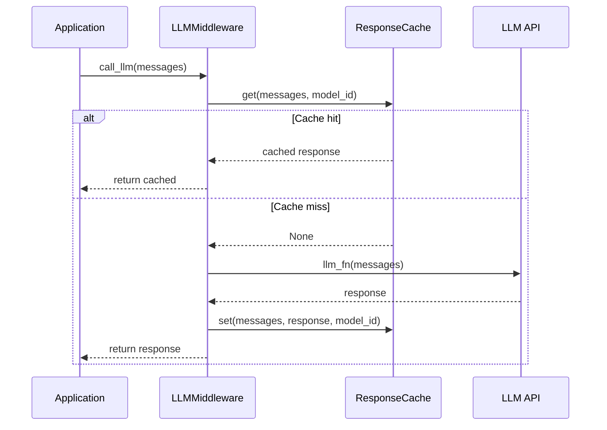

# LLMMiddleware and AsyncLLMMiddleware

Intercept any LLM callable -- sync or async -- with transparent response caching. Wrap your function once and every subsequent call with identical messages returns the cached result instantly, eliminating redundant API calls and reducing both latency and cost.

## Overview

`LLMMiddleware` wraps synchronous LLM callables with `ResponseCache` lookups. `AsyncLLMMiddleware` extends this to handle both coroutine functions and regular functions, auto-detecting the type at wrap time.

Both classes act as callable decorators: pass your function to them (or use `@` syntax) and get back a wrapper that checks the cache before invoking the original.

**When to use:**

- You have a custom LLM function (not framework-managed) that you want to cache.
- You want decorator-style caching without modifying the function body.
- You need model-aware cache keys so that different models maintain separate cache entries.

---

## Installation

No additional dependencies are required beyond the base `chengeta-ai` package.

```bash
pip install chengeta-ai
```

---

## Usage

### Synchronous LLM Caching

=== "Decorator"

    ```python
    from chengeta_ai import (
        CacheManager, InMemoryBackend, CacheKeyBuilder,
        ResponseCache, LLMMiddleware,
    )

    manager = CacheManager(
        backend=InMemoryBackend(),
        key_builder=CacheKeyBuilder(namespace="myapp"),
    )
    response_cache = ResponseCache(manager)
    key_builder = CacheKeyBuilder(namespace="myapp")

    middleware = LLMMiddleware(
        response_cache=response_cache,
        key_builder=key_builder,
        model_id="gpt-4o",
    )

    @middleware
    def call_llm(messages):
        """Call the OpenAI API."""
        import openai
        client = openai.OpenAI()
        return client.chat.completions.create(
            model="gpt-4o", messages=messages
        )

    # First call hits the API
    result = call_llm([{"role": "user", "content": "What is caching?"}])

    # Second call returns from cache (no API call)
    result = call_llm([{"role": "user", "content": "What is caching?"}])
    ```

=== "Explicit wrapping"

    ```python
    def raw_llm_call(messages):
        import openai
        client = openai.OpenAI()
        return client.chat.completions.create(
            model="gpt-4o", messages=messages
        )

    cached_llm = middleware(raw_llm_call)
    result = cached_llm([{"role": "user", "content": "What is caching?"}])
    ```

=== "Using decorate()"

    ```python
    cached_llm = middleware.decorate(raw_llm_call)
    result = cached_llm([{"role": "user", "content": "Explain decorators"}])
    ```

### Async LLM Caching

=== "Async function"

    ```python
    from chengeta_ai import AsyncLLMMiddleware

    async_middleware = AsyncLLMMiddleware(
        response_cache=response_cache,
        key_builder=key_builder,
        model_id="gpt-4o",
    )

    @async_middleware
    async def call_llm_async(messages):
        import openai
        client = openai.AsyncOpenAI()
        return await client.chat.completions.create(
            model="gpt-4o", messages=messages
        )

    # In an async context
    result = await call_llm_async([{"role": "user", "content": "Hello"}])
    ```

=== "Sync function (auto-detected)"

    ```python
    @async_middleware
    def call_llm_sync(messages):
        """AsyncLLMMiddleware also handles sync functions."""
        import openai
        client = openai.OpenAI()
        return client.chat.completions.create(
            model="gpt-4o", messages=messages
        )

    # Returns a sync wrapper -- no await needed
    result = call_llm_sync([{"role": "user", "content": "Hello"}])
    ```

### Multiple Models

Use separate middleware instances to maintain isolated caches per model.

```python
gpt4_middleware = LLMMiddleware(
    response_cache=response_cache,
    key_builder=key_builder,
    model_id="gpt-4o",
)

claude_middleware = LLMMiddleware(
    response_cache=response_cache,
    key_builder=key_builder,
    model_id="claude-sonnet-4-20250514",
)

@gpt4_middleware
def call_gpt4(messages):
    ...

@claude_middleware
def call_claude(messages):
    ...
```

!!! note
    The `model_id` parameter is used as a key discriminator. The same messages sent to different models will produce different cache keys and therefore separate cache entries.

### Keyword Arguments

The middleware extracts messages from the first positional argument or from the `messages` keyword argument.

```python
@middleware
def call_llm(messages):
    ...

# Both forms work
call_llm([{"role": "user", "content": "Hi"}])
call_llm(messages=[{"role": "user", "content": "Hi"}])
```

---

## API Reference

### LLMMiddleware

Wraps synchronous LLM callables with response caching.

**Constructor:**

| Parameter | Type | Default | Description |
|---|---|---|---|
| `response_cache` | `ResponseCache` | *(required)* | The response cache layer instance |
| `key_builder` | `CacheKeyBuilder` | *(required)* | Key builder for cache key generation |
| `model_id` | `str` | `"default"` | Model identifier used as a key discriminator |

**Methods:**

| Method | Signature | Description |
|---|---|---|
| `__call__` | `(llm_fn: Callable) -> Callable` | Wraps `llm_fn` with cache lookup/store logic. Returns a new function with the same signature. |
| `decorate` | `(fn: Callable) -> Callable` | Alias for `__call__`. Useful when you want a named method instead of calling the instance directly. |

### AsyncLLMMiddleware

Wraps sync or async LLM callables with response caching. Automatically detects whether the wrapped function is a coroutine function.

**Constructor:**

| Parameter | Type | Default | Description |
|---|---|---|---|
| `response_cache` | `ResponseCache` | *(required)* | The response cache layer instance |
| `key_builder` | `CacheKeyBuilder` | *(required)* | Key builder for cache key generation |
| `model_id` | `str` | `"default"` | Model identifier used as a key discriminator |

**Methods:**

| Method | Signature | Description |
|---|---|---|
| `__call__` | `(llm_fn: Callable) -> Callable` | Wraps `llm_fn`. If `llm_fn` is a coroutine function, returns an async wrapper. Otherwise, returns a sync wrapper. |
| `decorate` | `(fn: Callable) -> Callable` | Alias for `__call__`. |

!!! warning
    `AsyncLLMMiddleware` currently delegates cache reads and writes to the synchronous `ResponseCache.get()` and `ResponseCache.set()` methods, even when wrapping an async function. The async wrapper only awaits the original LLM call itself. If your backend requires true async I/O (e.g., an async Redis client), you will need to implement a fully async cache layer.

---

## How It Works


