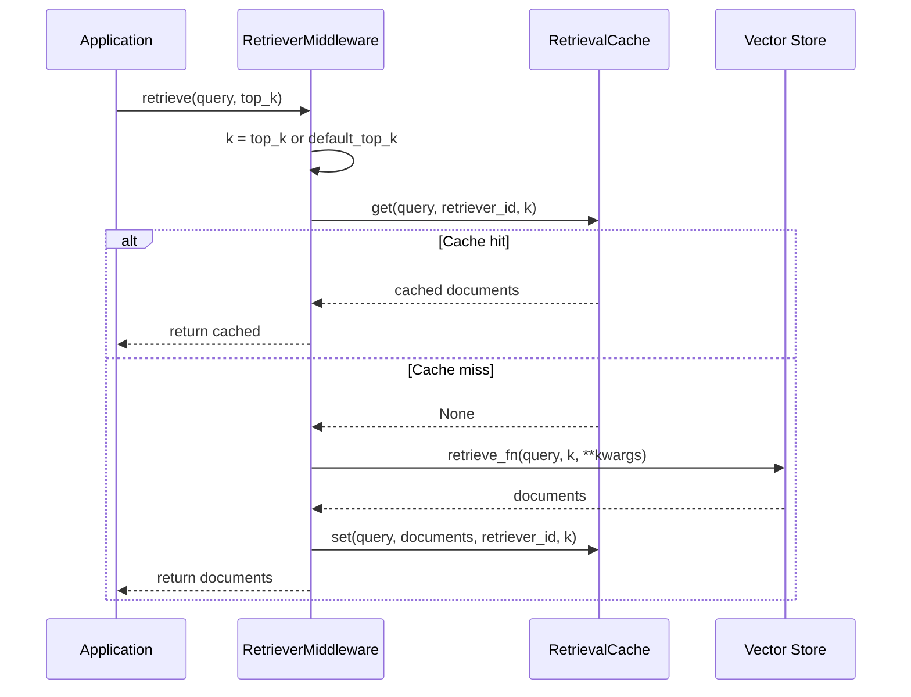

# RetrieverMiddleware

Intercept any retriever callable with transparent result caching. Wrap your retrieval function once and every subsequent call with the same query and `top_k` returns the cached document list instantly, eliminating redundant vector searches and database lookups.

## Overview

`RetrieverMiddleware` wraps a retriever callable with `RetrievalCache` lookups. It auto-detects whether the wrapped function is synchronous or asynchronous and produces the appropriate wrapper. The cache key incorporates the query text, a retriever identifier, and the `top_k` parameter, so the same query with different `top_k` values produces separate cache entries.

**When to use:**

- You have a custom retriever function (Pinecone, Weaviate, FAISS, or any vector store query) that you want to cache.
- You are building a RAG pipeline and want to avoid re-querying the vector store for identical queries.
- You need retriever-aware cache keys so that results from different retriever sources are stored separately.

---

## Installation

No additional dependencies are required beyond the base `chengeta-ai` package.

```bash
pip install chengeta-ai
```

---

## Usage

### Synchronous Retriever Caching

=== "Decorator"

    ```python
    from chengeta_ai import (
        CacheManager, InMemoryBackend, CacheKeyBuilder, RetrievalCache,
    )
    from chengeta_ai.middleware.retriever_middleware import RetrieverMiddleware

    manager = CacheManager(
        backend=InMemoryBackend(),
        key_builder=CacheKeyBuilder(namespace="myapp"),
    )
    retrieval_cache = RetrievalCache(manager)

    middleware = RetrieverMiddleware(
        retrieval_cache=retrieval_cache,
        retriever_id="pinecone-prod",
        default_top_k=5,
    )

    @middleware
    def retrieve(query: str, top_k: int):
        """Query the Pinecone index."""
        return pinecone_index.query(
            vector=embed(query), top_k=top_k, include_metadata=True
        )

    # First call queries the vector store
    docs = retrieve("What is RAG?")

    # Second call returns from cache
    docs = retrieve("What is RAG?")
    ```

=== "Explicit wrapping"

    ```python
    def raw_retrieve(query: str, top_k: int):
        return pinecone_index.query(
            vector=embed(query), top_k=top_k
        )

    cached_retrieve = middleware(raw_retrieve)
    docs = cached_retrieve("What is RAG?")
    ```

=== "Using decorate()"

    ```python
    cached_retrieve = middleware.decorate(raw_retrieve)
    docs = cached_retrieve("What is RAG?", top_k=10)
    ```

### Async Retriever Caching

```python
@middleware
async def retrieve_async(query: str, top_k: int):
    """Async retriever call."""
    return await async_vector_store.query(query, top_k=top_k)

# In an async context
docs = await retrieve_async("Explain transformers")
```

!!! tip
    `RetrieverMiddleware` auto-detects coroutine functions. Use the same middleware instance for both sync and async functions.

### Custom top_k

The `top_k` parameter is a first-class cache key discriminator. Different `top_k` values for the same query produce separate cache entries:

```python
# These are cached independently
docs_5 = retrieve("What is RAG?", top_k=5)
docs_10 = retrieve("What is RAG?", top_k=10)
```

If `top_k` is not provided by the caller, the `default_top_k` value from the middleware constructor is used.

### Multiple Retrievers

```python
pinecone_mw = RetrieverMiddleware(
    retrieval_cache=retrieval_cache,
    retriever_id="pinecone",
    default_top_k=5,
)

weaviate_mw = RetrieverMiddleware(
    retrieval_cache=retrieval_cache,
    retriever_id="weaviate",
    default_top_k=10,
)

@pinecone_mw
def search_pinecone(query: str, top_k: int):
    ...

@weaviate_mw
def search_weaviate(query: str, top_k: int):
    ...
```

### RAG Pipeline Example

Combine `RetrieverMiddleware` and `LLMMiddleware` to cache both the retrieval and generation stages:

```python
from chengeta_ai import LLMMiddleware, ResponseCache

response_cache = ResponseCache(manager)

llm_middleware = LLMMiddleware(
    response_cache=response_cache,
    key_builder=CacheKeyBuilder(namespace="myapp"),
    model_id="gpt-4o",
)

@middleware
def retrieve(query: str, top_k: int):
    return vector_store.query(query, top_k=top_k)

@llm_middleware
def generate(messages):
    return openai_client.chat.completions.create(
        model="gpt-4o", messages=messages
    )

def rag_pipeline(question: str):
    docs = retrieve(question, top_k=5)
    context = "\n".join(doc["text"] for doc in docs)
    messages = [
        {"role": "system", "content": f"Context:\n{context}"},
        {"role": "user", "content": question},
    ]
    return generate(messages)
```

---

## API Reference

### RetrieverMiddleware

**Constructor:**

| Parameter | Type | Default | Description |
|---|---|---|---|
| `retrieval_cache` | `RetrievalCache` | *(required)* | The retrieval cache layer instance |
| `retriever_id` | `str` | `"default"` | Identifier for the retriever source, used as a key discriminator |
| `default_top_k` | `int` | `5` | Default `top_k` value used when the caller does not provide one |

**Methods:**

| Method | Signature | Description |
|---|---|---|
| `__call__` | `(retrieve_fn: Callable) -> Callable` | Wraps `retrieve_fn` with cache lookup/store logic. Auto-detects sync vs async. |
| `decorate` | `(fn: Callable) -> Callable` | Alias for `__call__`. |

**Wrapped function signature:**

The wrapped function is expected to accept `(query: str, top_k: int | None = None, **kwargs)`. The middleware intercepts `query` and `top_k` for cache key generation, and passes all arguments through to the original function.

!!! note
    The middleware substitutes the `default_top_k` value when `top_k` is `None`. This means the original function always receives an integer `top_k`, even if the caller omitted it.

---

## How It Works



!!! warning
    `RetrieverMiddleware` delegates cache reads and writes to the synchronous `RetrievalCache.get()` and `RetrievalCache.set()` methods, even when wrapping an async function. The async wrapper only awaits the retriever call itself.
