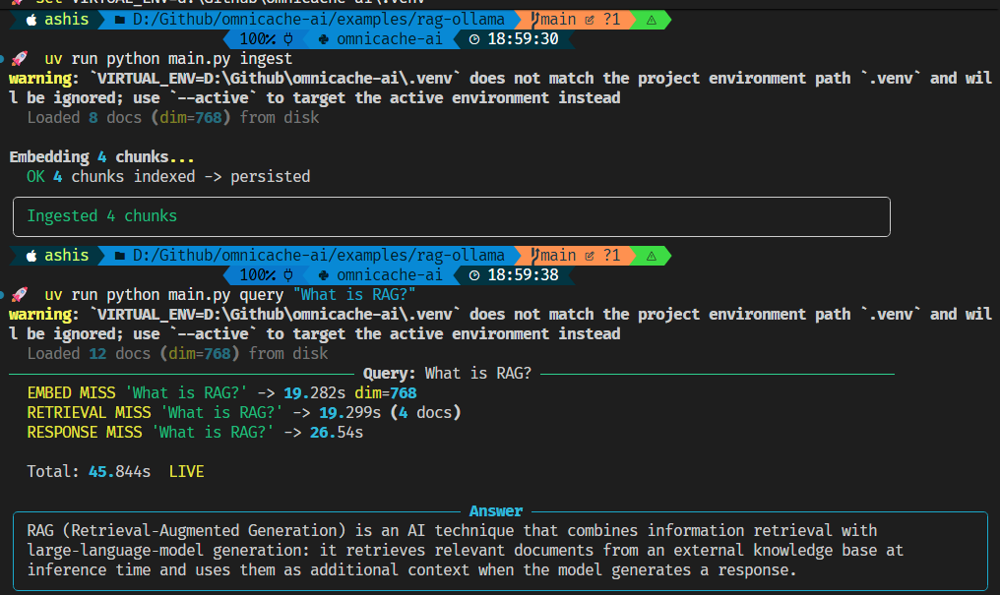
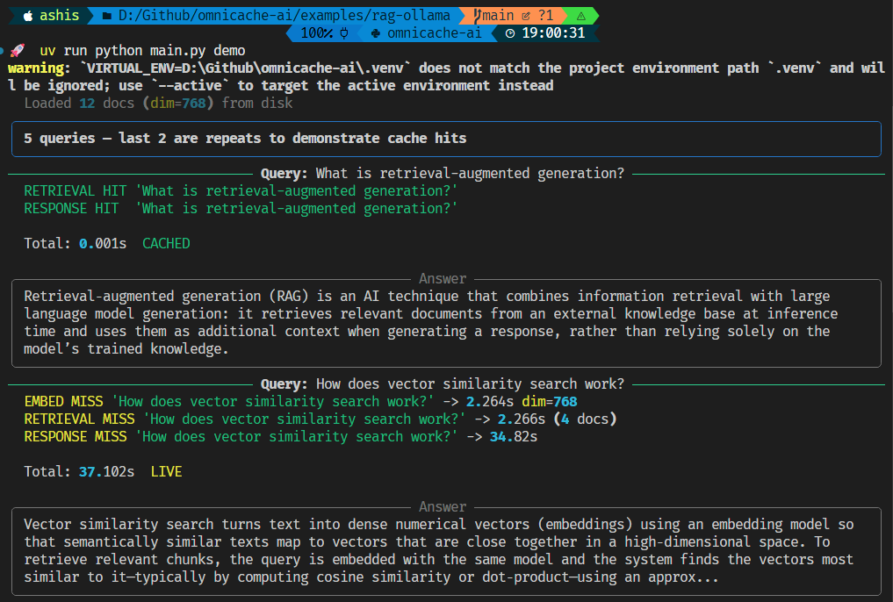
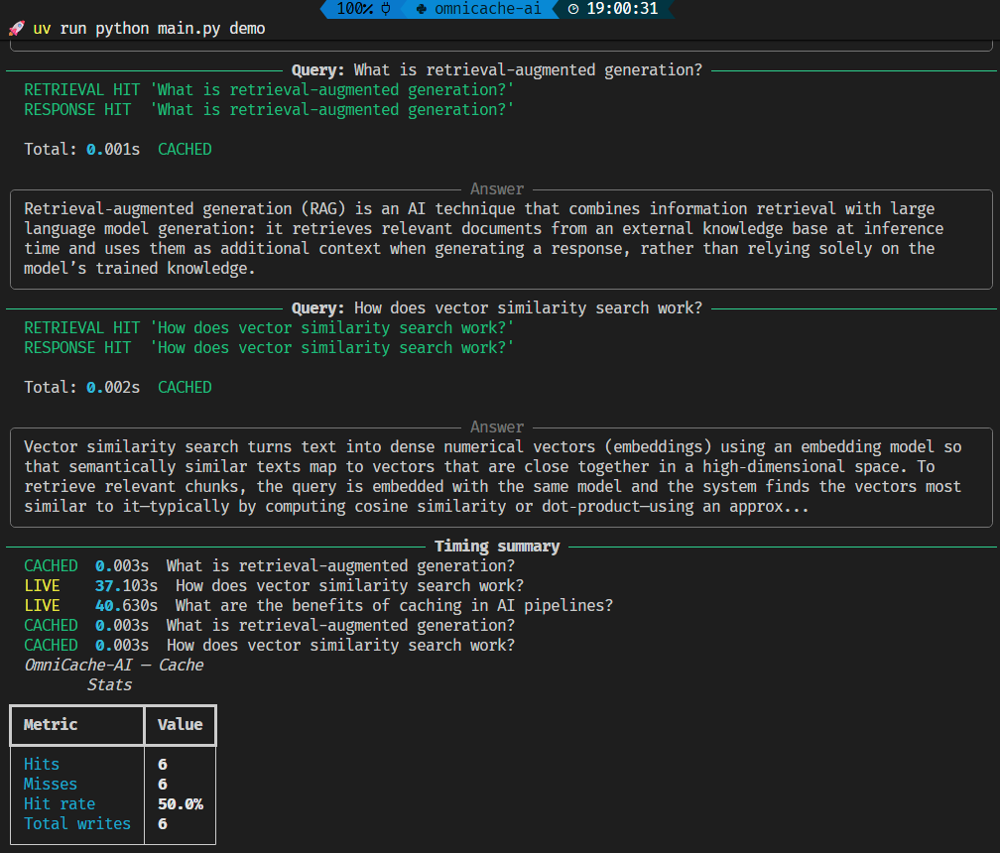

# RAG + Chengeta AI

RAG pipeline with three Chengeta AI caching layers:

| Layer | Class | Caches | Bypasses |
|---|---|---|---|
| 1 | `EmbeddingCache` | text -> float32 vector | Ollama embed API |
| 2 | `RetrievalCache` | query -> doc list | FAISS search |
| 3 | `ResponseCache` | messages -> answer | OpenRouter LLM |

**LLM:** OpenRouter `nvidia/nemotron-3-super-120b-a12b:free`
**Embeddings:** Ollama `embeddinggemma:300m` (local, no API key needed)
**Vector index:** FAISS (in-process)
**Cache backend:** TieredBackend (InMemory L1 + DiskBackend L2)

Measured: first query **45s** live → repeat query **0.002s** from cache.

---

## Requirements

- Python 3.12+
- [Ollama](https://ollama.ai) installed and running
- OpenRouter API key (free at [openrouter.ai](https://openrouter.ai))

---

## Activate / Install

```powershell
# Navigate to the project folder
cd examples/rag-ollama

# Install all dependencies into a local .venv (one-time)
uv sync
```

After `uv sync`, two ways to run:

**Option 1 — `uv run` (no activation needed):**
```powershell
uv run python main.py ingest
uv run python main.py query "What is RAG?"
```

**Option 2 — activate the venv manually:**
```powershell
# Windows
.venv\Scripts\activate

# macOS / Linux
source .venv/bin/activate

# Then run normally
python main.py ingest
python main.py query "What is RAG?"
```

> `uv run` is the recommended approach — automatically uses the project `.venv`
> without manual activation.

---

## Setup (first time)

```powershell
# 1. Pull the Ollama embedding model
ollama pull embeddinggemma:300m

# 2. Install dependencies
cd examples/rag-ollama
uv sync

# 3. Copy env file and add your OpenRouter API key
copy .env.example .env
# Open .env and set OPENROUTER_API_KEY=sk-or-v1-...

# 4. Index the sample knowledge base
uv run python main.py ingest
```



```powershell
# 5. Ask a question
uv run python main.py query "What is retrieval-augmented generation?"

# 6. Run the full demo (5 queries, last 2 are repeats to show cache speedup)
uv run python main.py demo
```

---

## Commands

| Command | Description |
|---|---|
| `uv run python main.py ingest` | Embed + index `data/docs.txt` into FAISS |
| `uv run python main.py query "..."` | Ask a question |
| `uv run python main.py demo` | 5 queries (2 repeats show cache hits) |
| `uv run python main.py stats` | Print cache hit/miss metrics |

---

## Demo output

First two queries are new (LIVE — 34–37s each). Last two are repeats — all cache layers hit, **0.001s**.



Timing summary and cache stats at the end of the demo run:



---

## How caching works

```mermaid
flowchart LR
    Q([User Query]) --> E1

    E1{EmbeddingCache.get}
    E1 -- HIT --> FAISS
    E1 -- MISS --> OL[Ollama /api/embeddings\n~2.5s]
    OL --> ES[EmbeddingCache.set]
    ES --> FAISS

    FAISS[FAISS similarity search\n<1ms] --> R1

    R1{RetrievalCache.get}
    R1 -- HIT --> RES1
    R1 -- MISS --> RF[run FAISS search]
    RF --> RS[RetrievalCache.set]
    RS --> RES1

    RES1{ResponseCache.get}
    RES1 -- HIT --> ANS
    RES1 -- MISS --> OR[OpenRouter LLM\n~34s]
    OR --> RESS[ResponseCache.set]
    RESS --> ANS

    ANS([Answer returned])

    style E1 fill:#1e3a5f,color:#fff
    style R1 fill:#14532d,color:#fff
    style RES1 fill:#4c1d95,color:#fff
    style OL fill:#7f1d1d,color:#fff
    style OR fill:#7f1d1d,color:#fff
    style ANS fill:#15803d,color:#fff
    style Q fill:#1e3a5f,color:#fff
```



**Repeat the same query: all three layers hit -> total < 1ms.**

---

## Measured latency (actual run)

| Call | Time | Cache state |
|---|---|---|
| First query (live) | ~45s | All misses — Ollama embed + FAISS + OpenRouter LLM |
| Repeat query | 0.001–0.003s | All hits — served from disk cache |

Cache persists across restarts (DiskBackend L2 at `~/.cache/rag-openrouter/`).

---

## Cache persistence

Cache lives at `~/.cache/rag-openrouter/`. To reset:

```powershell
# Windows
rmdir /s /q %USERPROFILE%\.cache\rag-openrouter

# macOS / Linux
rm -rf ~/.cache/rag-openrouter/
```

---

## Use your own documents

```python
from rag import RAGPipeline

pipeline = RAGPipeline()
pipeline.ingest_texts(["Your document text...", "Another doc..."])
print(pipeline.query("What does the document say about X?"))
```

---

## Project structure

```
examples/rag-ollama/
  rag/
    cache.py       CacheManager + three cache layers
    embedder.py    Ollama /api/embeddings with EmbeddingCache
    indexer.py     FAISS document index with RetrievalCache
    generator.py   OpenRouter LLM with ResponseCache
    pipeline.py    RAG pipeline wiring all layers together
  assets/
    ingest.png     ingest command output screenshot
    demo.png       demo run — cache hits vs live queries
    demo_.png      timing summary + cache stats table
  data/
    docs.txt       Sample knowledge base (AI / RAG / caching topics)
  main.py          CLI (ingest / query / demo / stats)
  .env             API keys (gitignored)
  .env.example     Template
```
