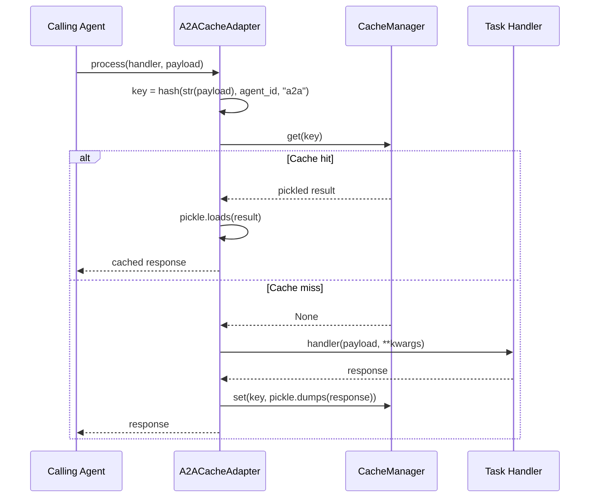

# A2ACacheAdapter

Cached inter-agent messaging for A2A workflows. `A2ACacheAdapter` caches the responses of agent task handlers, supporting both explicit `process()` / `aprocess()` calls and a `@wrap` decorator pattern. Compatible with the Google A2A SDK and any custom Agent-to-Agent implementation.

## Overview

In Agent-to-Agent (A2A) architectures, agents communicate by sending task payloads and receiving responses. Each handler invocation can trigger LLM calls, tool executions, or further downstream agent calls. `A2ACacheAdapter` caches the response for each unique payload, so repeated messages return instantly from cache.

Unlike the other wrapper adapters, `A2ACacheAdapter` does not wrap a specific agent object. Instead, it wraps handler *functions* -- either by passing the handler to `process()` / `aprocess()`, or by using the `@wrap` decorator.

**When to use:**

- You are building a multi-agent system where agents communicate via message passing.
- You want to cache responses for repeated inter-agent messages.
- You are using the Google A2A SDK or a custom A2A protocol.
- You want a decorator-based approach to add caching to existing handler functions.

---

## Installation

No additional framework dependencies are required. The A2A adapter works with any handler function.

```bash
pip install chengeta-ai
```

---

## Usage

### Decorator Pattern

The simplest way to add caching to a handler function:

```python
from chengeta_ai import CacheManager, InMemoryBackend, CacheKeyBuilder
from chengeta_ai.adapters.a2a_adapter import A2ACacheAdapter

manager = CacheManager(
    backend=InMemoryBackend(),
    key_builder=CacheKeyBuilder(namespace="myapp"),
)

adapter = A2ACacheAdapter(manager, agent_id="planner")

@adapter.wrap
def handle_task(task_payload: dict) -> dict:
    """Process a task from another agent."""
    # Expensive operation: call LLM, query database, etc.
    return {"status": "done", "result": process(task_payload)}

# First call executes the handler
result = handle_task({"action": "plan", "goal": "Summarize document"})

# Second call with same payload returns from cache
result = handle_task({"action": "plan", "goal": "Summarize document"})
```

### Explicit Process

When you want to control which handler is called:

```python
adapter = A2ACacheAdapter(manager, agent_id="executor")

def run_task(payload: dict) -> dict:
    return downstream_agent.execute(payload)

# Pass handler and payload explicitly
result = adapter.process(run_task, {"task": "summarize", "text": "..."})

# Cached for the same payload
result = adapter.process(run_task, {"task": "summarize", "text": "..."})
```

### Async Process

```python
adapter = A2ACacheAdapter(manager, agent_id="researcher")

async def research(payload: dict) -> dict:
    return await llm.generate(payload["query"])

# Async handler
result = await adapter.aprocess(research, {"query": "What is A2A?"})

# Cached on second call
result = await adapter.aprocess(research, {"query": "What is A2A?"})
```

### Multiple Agent IDs

Use different `agent_id` values to maintain separate caches per agent:

```python
planner_adapter = A2ACacheAdapter(manager, agent_id="planner")
executor_adapter = A2ACacheAdapter(manager, agent_id="executor")
reviewer_adapter = A2ACacheAdapter(manager, agent_id="reviewer")

@planner_adapter.wrap
def handle_planning(payload: dict) -> dict:
    ...

@executor_adapter.wrap
def handle_execution(payload: dict) -> dict:
    ...

@reviewer_adapter.wrap
def handle_review(payload: dict) -> dict:
    ...
```

### Google A2A SDK Integration

```python
from a2a.server import A2AServer
from chengeta_ai.adapters.a2a_adapter import A2ACacheAdapter

adapter = A2ACacheAdapter(manager, agent_id="my-agent")

@adapter.wrap
def handle_a2a_task(task_payload: dict) -> dict:
    """Handler for incoming A2A tasks."""
    return agent.process(task_payload)

# Register with the A2A server
server = A2AServer(handler=handle_a2a_task)
```

### With Redis Backend

```python
from chengeta_ai.backends.redis_backend import RedisBackend

manager = CacheManager(
    backend=RedisBackend(url="redis://localhost:6379/0"),
    key_builder=CacheKeyBuilder(namespace="a2a"),
)
adapter = A2ACacheAdapter(manager, agent_id="planner")
```

### Pipeline of Agents

Cache each stage in a multi-agent pipeline:

```python
planner = A2ACacheAdapter(manager, agent_id="planner")
researcher = A2ACacheAdapter(manager, agent_id="researcher")
writer = A2ACacheAdapter(manager, agent_id="writer")

def pipeline(goal: str) -> str:
    plan = planner.process(plan_handler, {"goal": goal})
    research = researcher.process(research_handler, {"plan": plan})
    article = writer.process(write_handler, {"research": research})
    return article
```

---

## API Reference

### A2ACacheAdapter

**Constructor:**

| Parameter | Type | Default | Description |
|---|---|---|---|
| `cache_manager` | `CacheManager` | *(required)* | The Chengeta AI cache manager instance |
| `agent_id` | `str` | `"default"` | Identifier for the agent being wrapped, used as a key discriminator |

**Methods:**

| Method | Signature | Description |
|---|---|---|
| `process` | `(handler, payload, **kwargs) -> Any` | Sync cached processing. Checks the cache by payload; on miss, calls `handler(payload, **kwargs)` and stores the result. |
| `aprocess` | `(handler, payload, **kwargs) -> Any` | Async cached processing. Checks the cache by payload; on miss, calls `await handler(payload, **kwargs)` and stores the result. |
| `wrap` | `(handler_fn) -> Callable` | Decorator that wraps a handler function with `process()`. Returns a new function with the same signature that automatically caches results. |

**Cache Key Generation:**

The cache key is built from `str(payload)`, the `agent_id`, and a `type` discriminator of `"a2a"`. This means:

- Different payloads produce different cache keys.
- Different `agent_id` values with the same payload produce different cache keys.
- The payload is converted to a string via `str()` for hashing, so objects with the same string representation share cache entries.

:::tip
Use meaningful `agent_id` values (e.g., `"planner"`, `"executor"`, `"reviewer"`) to keep cache entries organized and to ensure that different agents do not share cache entries for the same payload.
:::


:::note
The `wrap` decorator creates a sync wrapper that delegates to `process()`. If you need async caching with the decorator pattern, use `aprocess()` directly instead of `@wrap`.
:::


:::warning
The cache key is based on `str(payload)`. If your payload objects do not have stable string representations (e.g., objects with memory addresses in their `__repr__`), consider converting them to dicts or JSON strings before passing to the adapter.
:::


---

## How It Works



### wrap() Decorator Flow

The `@wrap` decorator is syntactic sugar that binds a handler function to the adapter's `process()` method:

```python
@adapter.wrap
def handle_task(payload):
    return result

# Equivalent to:
def handle_task(payload):
    return result

handle_task = lambda payload, **kw: adapter.process(original_handle_task, payload, **kw)
```

The decorator preserves the original function's name and docstring via `functools.wraps`.
