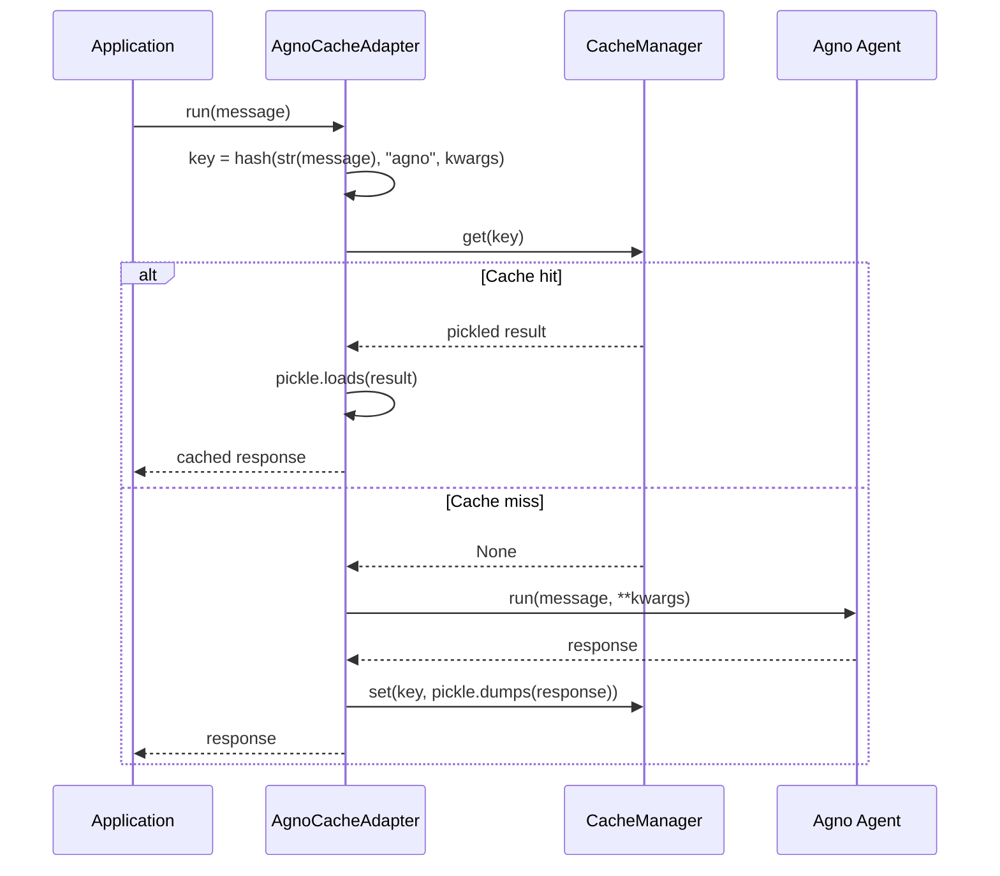

# AgnoCacheAdapter

Cached agent execution for Agno. `AgnoCacheAdapter` wraps an Agno `Agent` instance and intercepts `run()` and `arun()` to cache responses keyed by the input message, avoiding redundant LLM calls for identical queries.

## Overview

Agno agents process messages through an LLM with optional tool calls. Each `run()` or `arun()` invocation can trigger one or more LLM calls and tool executions. `AgnoCacheAdapter` caches the final response so that identical messages return instantly from cache on subsequent calls.

The adapter is a transparent proxy: all attributes and methods not explicitly overridden are forwarded to the original `Agent` instance via `__getattr__`.

**When to use:**

- You are using Agno agents and want to cache responses for repeated queries.
- You are running agents in a loop, batch processing, or testing and want deterministic, fast results.
- You want to integrate Agno agent caching with Chengeta AI's unified cache layer.

---

## Installation

```bash
pip install 'chengeta-ai[agno]'
```

This installs `agno >= 0.1` alongside `chengeta-ai`.

---

## Usage

### Synchronous Run

```python
from agno.agent import Agent
from agno.models.openai import OpenAIChat
from chengeta_ai import CacheManager, InMemoryBackend, CacheKeyBuilder
from chengeta_ai.adapters.agno_adapter import AgnoCacheAdapter

manager = CacheManager(
    backend=InMemoryBackend(),
    key_builder=CacheKeyBuilder(namespace="myapp"),
)

# Create an Agno agent
agent = Agent(
    model=OpenAIChat(id="gpt-4o"),
    description="A helpful assistant.",
)

# Wrap with caching
cached_agent = AgnoCacheAdapter(agent, manager)

# First call hits the LLM
response = cached_agent.run("What is AI?")

# Second call returns from cache
response = cached_agent.run("What is AI?")
```

### Async Run

```python
# Async execution with caching
response = await cached_agent.arun("Explain transformers")

# Cached on second call
response = await cached_agent.arun("Explain transformers")
```

### With Additional Keyword Arguments

Extra keyword arguments are included in the cache key, so different parameter combinations produce separate cache entries:

```python
# These are cached independently
response_1 = cached_agent.run("Tell me about AI", stream=False)
response_2 = cached_agent.run("Tell me about AI", stream=True)
```

### Transparent Proxy

All non-cached attributes pass through to the original agent:

```python
cached_agent = AgnoCacheAdapter(agent, manager)

# These proxy to the original Agent object
print(cached_agent.model)
print(cached_agent.description)
print(cached_agent.tools)
```

### With Redis Backend

```python
from chengeta_ai.backends.redis_backend import RedisBackend

manager = CacheManager(
    backend=RedisBackend(url="redis://localhost:6379/0"),
    key_builder=CacheKeyBuilder(namespace="agno"),
)
cached_agent = AgnoCacheAdapter(agent, manager)
```

### With Disk Persistence

```python
from chengeta_ai import DiskBackend

manager = CacheManager(
    backend=DiskBackend(directory="/tmp/agno_cache"),
    key_builder=CacheKeyBuilder(namespace="agno"),
)
cached_agent = AgnoCacheAdapter(agent, manager)

# Results persist across process restarts
response = cached_agent.run("What is caching?")
```

### Multiple Agents

Wrap each agent individually for independent caching:

```python
research_agent = Agent(model=OpenAIChat(id="gpt-4o"), description="Researcher")
writer_agent = Agent(model=OpenAIChat(id="gpt-4o"), description="Writer")

cached_researcher = AgnoCacheAdapter(research_agent, manager)
cached_writer = AgnoCacheAdapter(writer_agent, manager)
```

---

## API Reference

### AgnoCacheAdapter

**Constructor:**

| Parameter | Type | Default | Description |
|---|---|---|---|
| `agent` | `Agent` | *(required)* | The Agno Agent instance to wrap |
| `cache_manager` | `CacheManager` | *(required)* | The Chengeta AI cache manager instance |

**Methods:**

| Method | Signature | Description |
|---|---|---|
| `run` | `(message: Any, **kwargs) -> Any` | Sync cached run. Checks the cache first; on miss, calls `agent.run(message, **kwargs)` and stores the result. |
| `arun` | `(message: Any, **kwargs) -> Any` | Async cached run. Checks the cache first; on miss, calls `await agent.arun(message, **kwargs)` and stores the result. |
| `__getattr__` | `(name: str) -> Any` | Transparent proxy -- forwards all non-overridden attribute accesses to the wrapped agent. |

**Cache Key Generation:**

The cache key is built from `str(message)`, a `type` discriminator of `"agno"`, and any additional keyword arguments converted to strings. This means:

- Different messages produce different cache keys.
- The same message with different keyword arguments produces different cache keys.
- The message is converted to a string via `str()`, so objects with the same string representation share cache entries.

:::note
The cache key does not include the agent's identity. If you wrap two different agents with the same `CacheManager` and send them the same message, they will share the cache entry. Use separate `CacheManager` instances or different `namespace` values if you need independent caches per agent.
:::


:::warning
`AgnoCacheAdapter` delegates cache reads and writes to synchronous `CacheManager.get()` and `CacheManager.set()` methods, even in `arun()`. Only the actual agent call (`await agent.arun(...)`) is awaited.
:::


---

## How It Works


