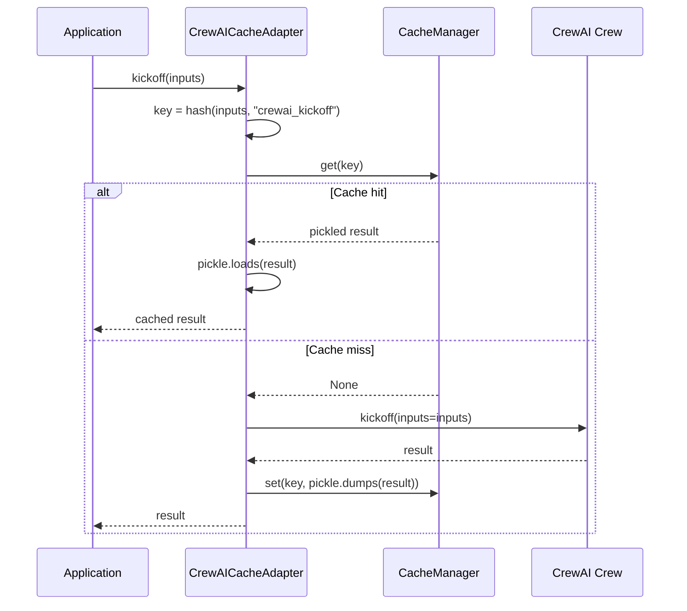

# CrewAICacheAdapter

Cached crew execution for CrewAI. `CrewAICacheAdapter` wraps a `Crew` instance and intercepts `kickoff()` to cache the final crew output keyed by inputs, avoiding re-execution of the entire multi-agent pipeline for identical input sets.

## Overview

CrewAI crews orchestrate multiple agents and tasks into a pipeline. Each `kickoff()` invocation can trigger many LLM calls, tool executions, and inter-agent interactions. `CrewAICacheAdapter` caches the final output of `kickoff()` so that identical input sets return instantly from cache on subsequent calls.

The adapter is a transparent proxy: all attributes and methods not explicitly overridden are forwarded to the original `Crew` instance via `__getattr__`.

**When to use:**

- You are running CrewAI crews with repeated or predictable inputs (e.g., batch processing, testing, demos).
- You want to avoid re-executing expensive multi-agent pipelines for identical inputs.
- You want to combine crew-level caching with Chengeta AI's other cache layers.

---

## Installation

```bash
pip install 'chengeta-ai[crewai]'
```

This installs `crewai >= 0.28` alongside `chengeta-ai`.

---

## Usage

### Synchronous Kickoff

```python
from crewai import Agent, Task, Crew
from chengeta_ai import CacheManager, InMemoryBackend, CacheKeyBuilder
from chengeta_ai.adapters.crewai_adapter import CrewAICacheAdapter

manager = CacheManager(
    backend=InMemoryBackend(),
    key_builder=CacheKeyBuilder(namespace="myapp"),
)

# Define your crew
researcher = Agent(
    role="Researcher",
    goal="Research the topic thoroughly",
    backstory="You are an expert researcher.",
    llm="gpt-4o",
)

writer = Agent(
    role="Writer",
    goal="Write a compelling article",
    backstory="You are a professional writer.",
    llm="gpt-4o",
)

research_task = Task(
    description="Research {topic}",
    expected_output="Detailed research notes",
    agent=researcher,
)

write_task = Task(
    description="Write an article about {topic} using the research",
    expected_output="A well-written article",
    agent=writer,
)

crew = Crew(agents=[researcher, writer], tasks=[research_task, write_task])

# Wrap with caching
cached_crew = CrewAICacheAdapter(crew, manager)

# First call executes the full crew pipeline
result = cached_crew.kickoff(inputs={"topic": "AI caching strategies"})

# Second call with same inputs returns from cache instantly
result = cached_crew.kickoff(inputs={"topic": "AI caching strategies"})
```

### Async Kickoff

```python
# Async execution with caching
result = await cached_crew.kickoff_async(inputs={"topic": "AI caching strategies"})

# Cached on second call
result = await cached_crew.kickoff_async(inputs={"topic": "AI caching strategies"})
```

### Transparent Proxy

All non-cached attributes pass through to the original crew:

```python
cached_crew = CrewAICacheAdapter(crew, manager)

# These proxy to the original Crew object
print(cached_crew.agents)    # [researcher, writer]
print(cached_crew.tasks)     # [research_task, write_task]
```

### With Disk Backend

Persist crew results across process restarts:

```python
from chengeta_ai import DiskBackend

manager = CacheManager(
    backend=DiskBackend(directory="/tmp/crewai_cache"),
    key_builder=CacheKeyBuilder(namespace="crewai"),
)
cached_crew = CrewAICacheAdapter(crew, manager)
```

### Different Input Sets

Each unique set of inputs produces a separate cache entry:

```python
# These are cached independently
result_ai = cached_crew.kickoff(inputs={"topic": "AI"})
result_ml = cached_crew.kickoff(inputs={"topic": "Machine Learning"})

# Cache hit for "AI"
result_ai_again = cached_crew.kickoff(inputs={"topic": "AI"})
```

### No Inputs

Crews that do not take inputs are cached with an empty dict key:

```python
result = cached_crew.kickoff()            # inputs=None -> key from {}
result = cached_crew.kickoff(inputs={})   # same key -> cache hit
```

---

## API Reference

### CrewAICacheAdapter

**Constructor:**

| Parameter | Type | Default | Description |
|---|---|---|---|
| `crew` | `Crew` | *(required)* | The CrewAI Crew instance to wrap |
| `cache_manager` | `CacheManager` | *(required)* | The Chengeta AI cache manager instance |

**Methods:**

| Method | Signature | Description |
|---|---|---|
| `kickoff` | `(inputs: dict \| None = None) -> Any` | Execute the crew with caching. Checks the cache first; on miss, calls `crew.kickoff(inputs=inputs)` and stores the result. |
| `kickoff_async` | `(inputs: dict \| None = None) -> Any` | Async version. Checks the cache first; on miss, calls `await crew.kickoff_async(inputs=inputs)` and stores the result. |
| `__getattr__` | `(name: str) -> Any` | Transparent proxy -- forwards all non-overridden attribute accesses to the wrapped crew. |

**Cache Key Generation:**

The cache key is built from the `inputs` dictionary (or an empty dict if `None`) and a `type` discriminator of `"crewai_kickoff"`. The key builder serializes and hashes the inputs deterministically, so the same set of key-value pairs always produces the same cache key regardless of insertion order.

:::tip
If your crew produces different outputs for the same inputs due to non-deterministic LLM behavior (e.g., temperature > 0), the first result is cached and returned for all subsequent calls. Consider this when deciding whether crew-level caching is appropriate for your use case.
:::


:::warning
`CrewAICacheAdapter` caches the entire crew output as a single unit. Individual task results within the crew are not cached separately. If you need per-task caching, consider using [LLMMiddleware](../middleware/llm.md) on the individual agent LLM calls instead.
:::


---

## How It Works


