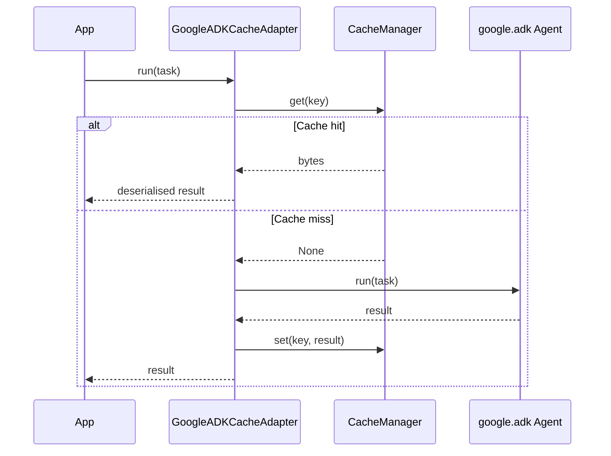

# GoogleADKCacheAdapter

Cache wrapper for Google Agent Development Kit (ADK) agents. Intercepts `Agent.run()` and `Agent.run_async()` calls and returns cached results for identical task inputs.

## Installation

```bash
pip install 'chengeta-ai[google-adk]'
```

---

## Usage

```python
from google.adk.agents import Agent
from chengeta_ai import CacheManager, InMemoryBackend, CacheKeyBuilder
from chengeta_ai.adapters.google_adk_adapter import GoogleADKCacheAdapter

agent = Agent(
    name="research_agent",
    model="gemini-2.0-flash",
    instruction="You are a research assistant.",
)

manager = CacheManager(
    backend=InMemoryBackend(),
    key_builder=CacheKeyBuilder(namespace="myapp"),
)
cached = GoogleADKCacheAdapter(agent, manager)

# Sync
response = cached.run("Summarise the latest AI research papers")

# Async
response = await cached.arun("Summarise the latest AI research papers")
```

### With Redis (shared across workers)

```python
from chengeta_ai.backends.redis_backend import RedisBackend

manager = CacheManager(
    backend=RedisBackend(url="redis://localhost:6379/0"),
    key_builder=CacheKeyBuilder(namespace="prod"),
)
cached = GoogleADKCacheAdapter(agent, manager)
```

### Invalidate by agent

```python
cached.invalidate_agent()  # clears all cached responses for this agent
```

---

## How It Works

The cache key is built from the agent `name` + serialised task input. Any attribute not overridden by the adapter proxies through to the original `Agent` object via `__getattr__`.



---

## API Reference

| Method | Description |
|---|---|
| `run(task, **kwargs)` | Cached synchronous agent run |
| `arun(task, **kwargs)` | Cached async agent run |
| `invalidate_agent()` | Invalidate all cached responses for this agent |

---

## Context Caching Note

Google ADK has its own server-side context caching (`ContextCacheConfig`) for Gemini models. `GoogleADKCacheAdapter` operates at the **application level** — it caches the final agent result before any model call, eliminating redundant agent orchestration entirely for repeated tasks.

For long shared system prompts, use both: ADK context caching saves tokens within a run; `GoogleADKCacheAdapter` eliminates entire runs for known inputs.
