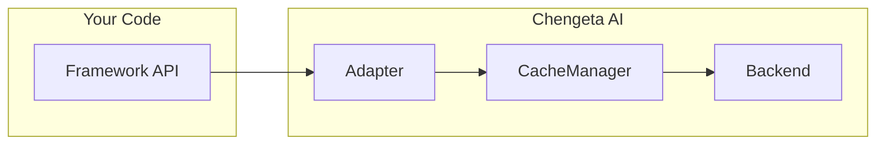

# Adapters

Chengeta AI adapters provide drop-in integrations with popular AI and agent frameworks. Each adapter implements the framework's native cache or agent interface, so you get caching without changing your existing code.

## Overview

Adapters bridge the gap between Chengeta AI's cache engine and the framework-specific APIs that each AI library expects. Instead of writing custom glue code, you instantiate an adapter with a `CacheManager` and plug it into the framework's standard extension point.

There are two adapter styles:

- **Interface adapters** (LangChain, LangGraph) — subclass the framework's cache/checkpointer base class and implement its required methods.
- **Wrapper adapters** (all others) — wrap an agent or handler with cache logic. Non-overridden attributes proxy through to the original object via `__getattr__`.



---

## Framework Support Matrix

| Adapter | Framework | Min Version | Extra | Interface |
|---|---|---|---|---|
| [`OpenAICacheAdapter`](openai-sdk.md) | OpenAI SDK | `openai >= 1.0` | `pip install 'chengeta-ai[openai]'` | `client.chat.completions.create` wrapper |
| [`AnthropicCacheAdapter`](anthropic-sdk.md) | Anthropic SDK | `anthropic >= 0.25` | `pip install 'chengeta-ai[anthropic]'` | `client.messages.create` wrapper |
| [`GoogleADKCacheAdapter`](google-adk.md) | Google ADK | `google-adk >= 0.1` | `pip install 'chengeta-ai[google-adk]'` | Agent wrapper |
| [`OpenAIAgentsCacheAdapter`](openai-agents.md) | OpenAI Agents SDK | `openai-agents` | `pip install openai-agents` | Runner wrapper |
| [`LlamaIndexLLMCacheAdapter`](llamaindex.md) | LlamaIndex | `llama-index-core >= 0.10` | `pip install 'chengeta-ai[llamaindex]'` | LLM drop-in |
| [`LlamaIndexQueryCacheAdapter`](llamaindex.md) | LlamaIndex | `llama-index-core >= 0.10` | `pip install 'chengeta-ai[llamaindex]'` | QueryEngine wrapper |
| [`ClaudeAgentCacheAdapter`](claude-agent.md) | Claude Agent SDK | `claude-code-sdk` | `pip install claude-code-sdk` | Async generator wrapper |
| [`LangChainCacheAdapter`](langchain.md) | LangChain | `langchain-core >= 0.2` | `pip install 'chengeta-ai[langchain]'` | `BaseCache` |
| [`LangGraphCacheAdapter`](langgraph.md) | LangGraph | `langgraph >= 0.1` | `pip install 'chengeta-ai[langgraph]'` | `BaseCheckpointSaver` |
| [`AutoGenCacheAdapter`](autogen.md) | AutoGen | `pyautogen >= 0.2` or `autogen-agentchat >= 0.4` | `pip install 'chengeta-ai[autogen]'` | Agent wrapper |
| [`CrewAICacheAdapter`](crewai.md) | CrewAI | `crewai >= 0.28` | `pip install 'chengeta-ai[crewai]'` | Crew wrapper |
| [`AgnoCacheAdapter`](agno.md) | Agno | `agno >= 0.1` | `pip install 'chengeta-ai[agno]'` | Agent wrapper |
| [`A2ACacheAdapter`](a2a.md) | A2A | — | `pip install chengeta-ai` | Handler wrapper / decorator |

---

## Quick Start

All adapters follow the same three-step pattern:

```python
from chengeta_ai import CacheManager, InMemoryBackend, CacheKeyBuilder

# 1. Create a CacheManager
manager = CacheManager(
    backend=InMemoryBackend(),
    key_builder=CacheKeyBuilder(namespace="myapp"),
)

# 2. Import the adapter
from chengeta_ai.adapters.langchain_adapter import LangChainCacheAdapter

# 3. Plug it in
adapter = LangChainCacheAdapter(manager)
```

---

## Choosing the Right Adapter

| If you use... | Use this adapter |
|---|---|
| OpenAI SDK directly | [`OpenAICacheAdapter`](openai-sdk.md) |
| Anthropic SDK directly | [`AnthropicCacheAdapter`](anthropic-sdk.md) |
| Google ADK agents | [`GoogleADKCacheAdapter`](google-adk.md) |
| OpenAI Agents SDK | [`OpenAIAgentsCacheAdapter`](openai-agents.md) |
| LlamaIndex LLMs | [`LlamaIndexLLMCacheAdapter`](llamaindex.md) |
| LlamaIndex QueryEngine (RAG) | [`LlamaIndexQueryCacheAdapter`](llamaindex.md) |
| Claude Agent SDK | [`ClaudeAgentCacheAdapter`](claude-agent.md) |
| LangChain chat models | [`LangChainCacheAdapter`](langchain.md) |
| LangGraph state graphs | [`LangGraphCacheAdapter`](langgraph.md) |
| AutoGen agents | [`AutoGenCacheAdapter`](autogen.md) |
| CrewAI crews | [`CrewAICacheAdapter`](crewai.md) |
| Agno agents | [`AgnoCacheAdapter`](agno.md) |
| Custom A2A messaging | [`A2ACacheAdapter`](a2a.md) |
| Custom LLM functions | [Middleware](../middleware/index.md) |

---

## Next Steps

- [Google ADK](google-adk.md) — Cache Google ADK agent runs
- [OpenAI Agents SDK](openai-agents.md) — Cache OpenAI Agents SDK runner results
- [LlamaIndex](llamaindex.md) — Cache LLM + QueryEngine results
- [Claude Agent SDK](claude-agent.md) — Cache Claude agent query() streams
- [LangChain](langchain.md) — Global LLM cache
- [LangGraph](langgraph.md) — Checkpoint persistence
- [AutoGen](autogen.md) — Cached agent replies
- [CrewAI](crewai.md) — Cached crew kickoff
- [Agno](agno.md) — Cached agent runs
- [A2A](a2a.md) — Cached inter-agent messaging
