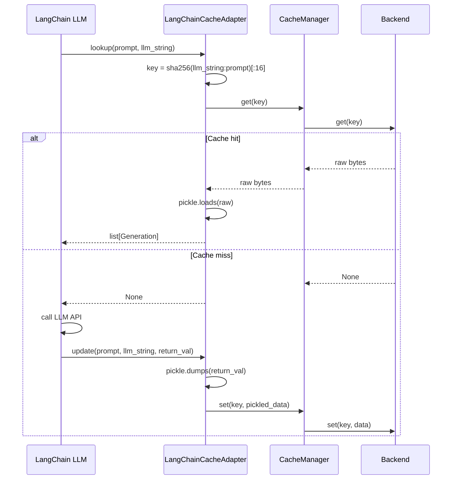

# LangChainCacheAdapter

Drop-in LLM response cache for LangChain. `LangChainCacheAdapter` implements `langchain_core.caches.BaseCache`, so you can register it globally with `set_llm_cache()` and every LLM call in your application is automatically cached through Chengeta AI.

## Overview

LangChain supports a global LLM cache that intercepts all calls to chat models and LLMs. By providing an adapter that subclasses `BaseCache`, Chengeta AI integrates seamlessly: LangChain calls `lookup()` before every LLM invocation and `update()` after, and the adapter maps these to `CacheManager.get()` and `CacheManager.set()`.

**When to use:**

- You are using LangChain chat models or LLMs and want to cache responses.
- You want a single global cache that applies to all LLM calls without modifying individual chain code.
- You want to use Chengeta AI backends (in-memory, disk, Redis) as the storage layer for LangChain's cache.

---

## Installation

```bash
pip install 'chengeta-ai[langchain]'
```

This installs `langchain-core >= 0.2` alongside `chengeta-ai`.

---

## Usage

### Global LLM Cache

```python
from langchain_core.globals import set_llm_cache
from langchain_openai import ChatOpenAI

from chengeta_ai import CacheManager, InMemoryBackend, CacheKeyBuilder
from chengeta_ai.adapters.langchain_adapter import LangChainCacheAdapter

# Set up Chengeta AI
manager = CacheManager(
    backend=InMemoryBackend(),
    key_builder=CacheKeyBuilder(namespace="myapp"),
)

# Register the adapter as LangChain's global cache
set_llm_cache(LangChainCacheAdapter(manager))

# All LLM calls are now cached
llm = ChatOpenAI(model="gpt-4o")
response = llm.invoke("What is caching?")   # hits the API
response = llm.invoke("What is caching?")   # returns from cache
```

### With Redis Backend

```python
from chengeta_ai.backends.redis_backend import RedisBackend

manager = CacheManager(
    backend=RedisBackend(url="redis://localhost:6379/0"),
    key_builder=CacheKeyBuilder(namespace="prod"),
)
set_llm_cache(LangChainCacheAdapter(manager))
```

### With Disk Backend

```python
from chengeta_ai import DiskBackend

manager = CacheManager(
    backend=DiskBackend(directory="/tmp/langchain_cache"),
    key_builder=CacheKeyBuilder(namespace="myapp"),
)
set_llm_cache(LangChainCacheAdapter(manager))
```

### Async Usage

The adapter provides `alookup()` and `aupdate()` async methods. These currently delegate to the synchronous implementations, so they work in async contexts without requiring an async backend.

```python
from langchain_openai import ChatOpenAI

llm = ChatOpenAI(model="gpt-4o")

# Async invocation uses alookup/aupdate under the hood
response = await llm.ainvoke("What is caching?")
```

### Using with Chains

Once the global cache is set, all chains and agents that use LLM calls benefit automatically:

```python
from langchain_core.prompts import ChatPromptTemplate
from langchain_openai import ChatOpenAI

prompt = ChatPromptTemplate.from_messages([
    ("system", "You are a helpful assistant."),
    ("user", "{question}"),
])
chain = prompt | ChatOpenAI(model="gpt-4o")

# Both calls produce the same prompt, so the second is cached
chain.invoke({"question": "What is AI?"})
chain.invoke({"question": "What is AI?"})
```

---

## API Reference

### LangChainCacheAdapter

Subclasses `langchain_core.caches.BaseCache`.

**Constructor:**

| Parameter | Type | Default | Description |
|---|---|---|---|
| `cache_manager` | `CacheManager` | *(required)* | The Chengeta AI cache manager instance |

**Methods:**

| Method | Signature | Description |
|---|---|---|
| `lookup` | `(prompt: str, llm_string: str) -> list[Generation] \| None` | Look up a cached response by prompt and LLM identifier string. Returns a list of `Generation` objects or `None` on cache miss. |
| `update` | `(prompt: str, llm_string: str, return_val: list[Generation]) -> None` | Store a response in the cache. The `return_val` is serialized via `pickle`. |
| `clear` | `(**kwargs) -> None` | No-op. Delegate to `CacheManager.invalidate()` or tag-based invalidation for selective clearing. |
| `alookup` | `(prompt: str, llm_string: str) -> list[Generation] \| None` | Async version of `lookup`. Currently delegates to the sync implementation. |
| `aupdate` | `(prompt: str, llm_string: str, return_val: list[Generation]) -> None` | Async version of `update`. Currently delegates to the sync implementation. |

:::note
The cache key is generated by hashing the combination of `llm_string` (which encodes the model name and parameters) and `prompt`. This means the same prompt sent to different models or with different parameters produces separate cache entries.
:::


:::warning
The `clear()` method is intentionally a no-op. Use `CacheManager.invalidate(tag)` for targeted invalidation, or replace the backend to clear everything. This prevents accidental deletion of shared cache data.
:::


---

## How It Works

The adapter generates cache keys by SHA-256 hashing the concatenation of `llm_string` and `prompt`, producing a key in the format `{namespace}:lc:{hash[:16]}`. Values are serialized with `pickle` for storage and deserialized on retrieval.


