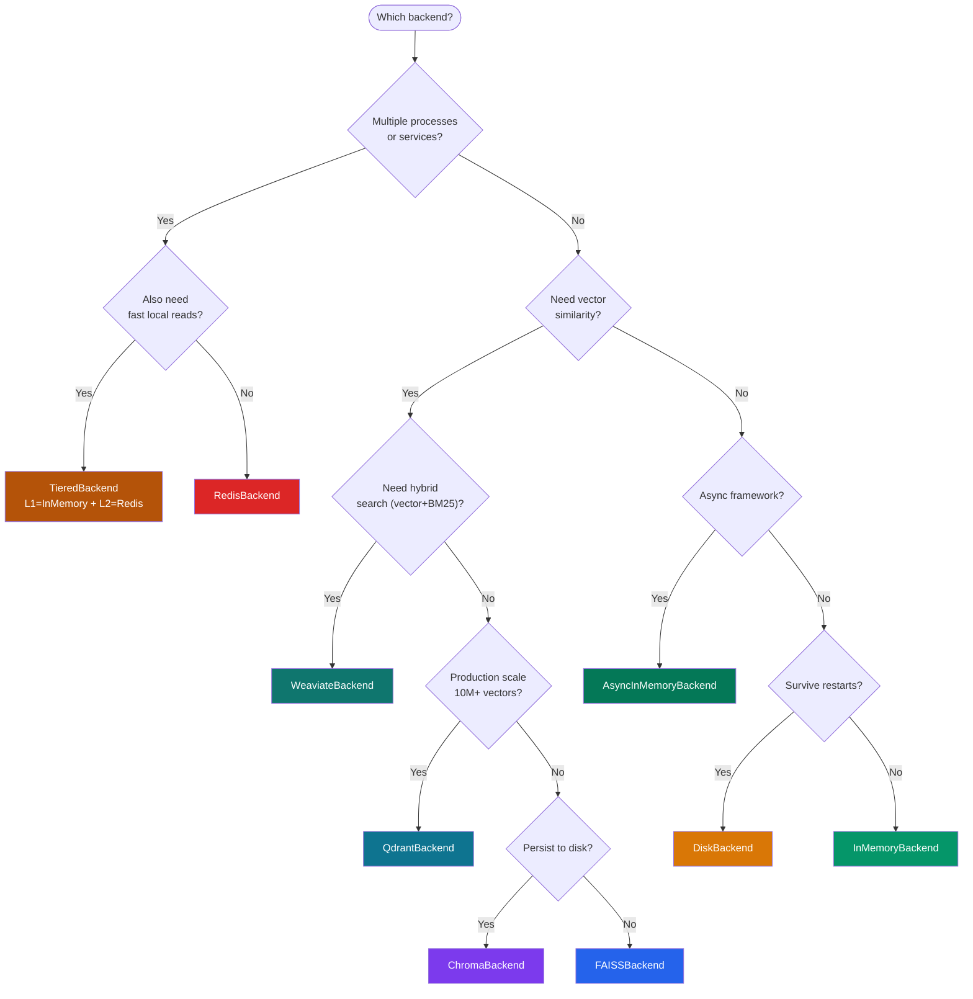

# Storage Backends

Chengeta AI provides nine interchangeable backends — four key-value stores, one tiered backend, one async backend, and three vector similarity stores. Every backend conforms to a `Protocol`, so you can swap implementations without changing application code.

---

## Key-Value Backends (CacheBackend)

| Backend | Class | Extras | Best For |
|---|---|---|---|
| [In-Memory (LRU)](memory.md) | `InMemoryBackend` | — (core) | Dev, testing, single-process |
| [Async In-Memory](async-memory.md) | `AsyncInMemoryBackend` | — (core) | FastAPI, async LangGraph |
| [Tiered (L1+L2)](tiered.md) | `TieredBackend` | — (core) | Memory speed + Redis persistence |
| [Disk](disk.md) | `DiskBackend` | — (core) | Single-node persistence |
| [Redis](redis.md) | `RedisBackend` | `[redis]` | Shared across processes / services |

## Vector Backends (VectorBackend)

| Backend | Class | Extras | Best For |
|---|---|---|---|
| [FAISS](faiss.md) | `FAISSBackend` | `[vector-faiss]` | Fast in-process similarity |
| [ChromaDB](chroma.md) | `ChromaBackend` | `[vector-chroma]` | Persistent vector store + metadata |
| [Qdrant](qdrant.md) | `QdrantBackend` | `[vector-qdrant]` | Production scale (22ms p95) |
| [Weaviate](weaviate.md) | `WeaviateBackend` | `[vector-weaviate]` | Hybrid search (vector + BM25) |

---

## Decision Flowchart



---

## Protocols

Both protocols are `@runtime_checkable` — verify with `isinstance()`.

### CacheBackend

```python
from chengeta_ai.backends.base import CacheBackend
# get / set / delete / exists / clear / close
```

### AsyncCacheBackend

```python
from chengeta_ai.backends.async_base import AsyncCacheBackend
# async get / set / delete / exists / clear / close
```

### VectorBackend

```python
from chengeta_ai.backends.base import VectorBackend
# add / search / delete / clear / close
```

---

## Custom Backend

Implement the `CacheBackend` protocol — no inheritance required:

```python
class MyBackend:
    def get(self, key: str): ...
    def set(self, key: str, value, ttl=None): ...
    def delete(self, key: str): ...
    def exists(self, key: str) -> bool: ...
    def clear(self): ...
    def close(self): ...
```
