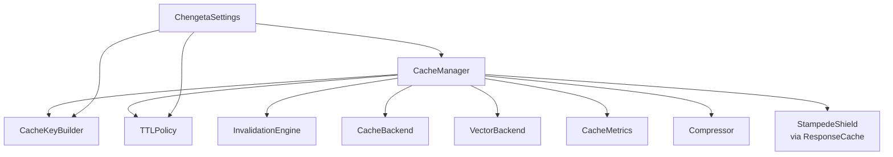

# Core Module

The core module is the foundation of Chengeta AI — the central orchestrator, key generation, policies, invalidation, metrics, serialization, compression, stampede protection, cache warming, and multi-tenant namespacing.

---

## Components

| Component | Module | Description |
|---|---|---|
| [CacheManager](cache-manager.md) | `chengeta_ai.core.cache_manager` | Central orchestrator — `get`, `set`, `invalidate`, `for_tenant()` |
| [CacheKeyBuilder](key-builder.md) | `chengeta_ai.core.key_builder` | `namespace:type:sha256[:16]` canonical keys |
| [CacheMetrics](metrics.md) | `chengeta_ai.core.metrics` | Hit/miss/eviction counters + provider cache savings |
| [Serializer](serializer.md) | `chengeta_ai.core.serializer` | Pluggable encode/decode — `PickleSerializer`, `JsonSerializer` |
| [Compressor](compressor.md) | `chengeta_ai.core.compressor` | Optional compression — `GzipCompressor`, `NoopCompressor` |
| [StampedeShield](stampede.md) | `chengeta_ai.core.stampede` | Per-key lock — prevents concurrent duplicate LLM calls |
| [RequestConfig](request-config.md) | `chengeta_ai.core.request_config` | Per-request TTL / threshold / `skip_cache` overrides |
| [CacheWarmer](warmer.md) | `chengeta_ai.core.warmer` | Bulk warm from query lists or CSV |
| [TTLPolicy](policies.md#ttlpolicy) | `chengeta_ai.core.policies` | Global + per-layer TTL configuration |
| [EvictionPolicy](policies.md#evictionpolicy) | `chengeta_ai.core.policies` | LRU / TTL-only strategy |
| [InvalidationEngine](invalidation.md) | `chengeta_ai.core.invalidation` | Tag-based bulk eviction |
| [Observability](observability.md) | `chengeta_ai.core.exporters` | Prometheus + OpenTelemetry exporters |
| [ChengetaSettings](settings.md) | `chengeta_ai.config.settings` | Unified config dataclass + `from_env()` |

---

## Architecture



---

## Quick Example

```python
from chengeta_ai import CacheManager, ChengetaSettings, CacheMetrics

manager = CacheManager.from_settings(ChengetaSettings.from_env())

key = manager.key_builder.build("response", "my prompt")
manager.set(key, b"cached-result", tags=["model:gpt-4o"])
value = manager.get(key)

# Per-tenant scope
tenant = manager.for_tenant("customer-42")

# Metrics
snap = manager.metrics.snapshot()
print(f"Hit rate: {snap['hit_rate']:.0%}")

# Tag invalidation
manager.invalidate("model:gpt-4o")
```

---

## Next Steps

- [CacheManager](cache-manager.md) — central API
- [CacheMetrics](metrics.md) — hit rate and cost tracking
- [StampedeShield](stampede.md) — concurrency safety
- [CacheWarmer](warmer.md) — pre-populate on startup
- [Observability](observability.md) — Prometheus / OTEL export
