# RAG + Chengeta AI

Full RAG pipeline with three caching layers — first query ~45s live, repeat query **< 1ms** from cache.

| Layer | Class | Caches | Bypasses |
|---|---|---|---|
| 1 | `EmbeddingCache` | text -> float32 vector | Ollama embed API |
| 2 | `RetrievalCache` | query -> doc list | FAISS search |
| 3 | `ResponseCache` | messages -> answer | OpenRouter LLM |

**LLM:** OpenRouter `nvidia/nemotron-3-super-120b-a12b:free`
**Embeddings:** Ollama `embeddinggemma:300m` (local, no API key needed)
**Vector index:** FAISS (in-process, dim auto-detected)
**Cache backend:** TieredBackend (InMemory L1 + DiskBackend L2)

---

## How caching works

```mermaid
flowchart LR
    Q([User Query]) --> E1

    E1{EmbeddingCache.get}
    E1 -- HIT --> FAISS
    E1 -- MISS --> OL["Ollama /api/embeddings\n~2.5s"]
    OL --> ES[EmbeddingCache.set]
    ES --> FAISS

    FAISS["FAISS similarity search\n<1ms"] --> R1

    R1{RetrievalCache.get}
    R1 -- HIT --> RES1
    R1 -- MISS --> RF[run FAISS search]
    RF --> RS[RetrievalCache.set]
    RS --> RES1

    RES1{ResponseCache.get}
    RES1 -- HIT --> ANS
    RES1 -- MISS --> OR["OpenRouter LLM\n~34s"]
    OR --> RESS[ResponseCache.set]
    RESS --> ANS

    ANS([Answer returned])

    style E1 fill:#1e3a5f,color:#fff
    style R1 fill:#14532d,color:#fff
    style RES1 fill:#4c1d95,color:#fff
    style OL fill:#7f1d1d,color:#fff
    style OR fill:#7f1d1d,color:#fff
    style ANS fill:#15803d,color:#fff
    style Q fill:#1e3a5f,color:#fff
```



---

## Setup

```bash
# 1. Pull Ollama embedding model
ollama pull embeddinggemma:300m

# 2. Clone and install
cd examples/rag-ollama
uv sync

# 3. Set your OpenRouter API key
cp .env.example .env
# Edit .env → OPENROUTER_API_KEY=sk-or-v1-...

# 4. Index documents
uv run python main.py ingest

# 5. Ask a question
uv run python main.py query "What is retrieval-augmented generation?"

# 6. Demo — shows cache speedup
uv run python main.py demo
```

---

## Commands

| Command | Description |
|---|---|
| `python main.py ingest` | Embed + index `data/docs.txt` into FAISS |
| `python main.py query "..."` | Ask a question |
| `python main.py demo` | 5 queries (2 repeats show cache hits) |
| `python main.py stats` | Print hit/miss metrics |

---

## Measured latency

| Call | Time | State |
|---|---|---|
| First query | ~45s | All misses — Ollama embed + FAISS + OpenRouter LLM |
| Repeat query | 0.001–0.003s | All hits — served from disk cache |

---

## Code walkthrough

### Cache setup (`rag/cache.py`)

```python
from chengeta_ai.backends.tiered_backend import TieredBackend
from chengeta_ai.backends.memory_backend import InMemoryBackend
from chengeta_ai.backends.disk_backend import DiskBackend
from chengeta_ai.core.policies import TTLPolicy

manager = CacheManager(
    backend=TieredBackend(
        l1=InMemoryBackend(max_size=2_000),   # hot entries in RAM
        l2=DiskBackend("~/.cache/rag-openrouter/store"),  # survives restarts
        l1_ttl=600,
    ),
    key_builder=CacheKeyBuilder(namespace="rag"),
    ttl_policy=TTLPolicy(
        default_ttl=3_600,
        per_type={"embedding": 86_400 * 7, "retrieval": 3_600, "response": 86_400},
    ),
)
```

### Embedding with cache (`rag/embedder.py`)

```python
# EmbeddingCache.set(text, vector, model_id)  ← correct arg order
cached = self._cache.get(text, self._model)
if cached is not None:
    return cached                          # skip Ollama entirely

vec = requests.post(
    "http://localhost:11434/api/embeddings",
    json={"model": model, "prompt": text}, timeout=120,
).json()["embedding"]

self._cache.set(text, np.array(vec, dtype=np.float32), self._model)
```

### Retrieval with cache (`rag/indexer.py`)

```python
# RetrievalCache.get(query, retriever_id, top_k)
cached = self._cache.get(query, retriever_id="faiss-openrouter", top_k=4)
if cached is not None:
    return cached                          # skip FAISS search

_, indices = self._index.search(query_vec, top_k)
docs = [self._documents[i] for i in indices[0]]
self._cache.set(query, docs, retriever_id="faiss-openrouter", top_k=4)
```

### Generation with cache (`rag/generator.py`)

```python
# ResponseCache.get(messages, model_id)  ← messages first
cached = self._cache.get(messages, self._model)
if cached is not None:
    return cached                          # skip OpenRouter entirely

answer = openai_client.chat.completions.create(
    model="nvidia/nemotron-3-super-120b-a12b:free",
    messages=messages,
).choices[0].message.content

# ResponseCache.set(messages, response, model_id)
self._cache.set(messages, answer, self._model)
```

---

## Source

:point_right: [`examples/rag-ollama/`](https://github.com/vigilancetrent/chengeta-ai/tree/main/examples/rag-ollama)
