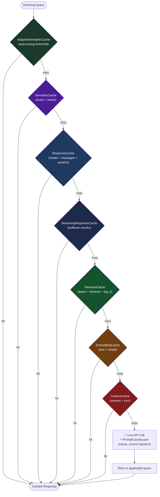

# Cache Layers

Chengeta AI ships eight purpose-built cache layers. Each targets a distinct stage of the AI pipeline with optimized serialization and a consistent `get` / `set` / `get_or_*` interface.

---

## At a Glance

| Layer | Class | What it caches | Key |
|---|---|---|---|
| [Response](response.md) | `ResponseCache` | LLM completions | model + messages + params |
| [Streaming](streaming.md) | `StreamingResponseCache` | Streaming LLM chunks (buffered) | model + messages + params |
| [Embedding](embedding.md) | `EmbeddingCache` | `np.ndarray` vectors | text + model |
| [Retrieval](retrieval.md) | `RetrievalCache` | Document lists | query + retriever + top_k |
| [Context](context.md) | `ContextCache` | Conversation history | session ID + turn index |
| [Semantic](semantic.md) | `SemanticCache` | Any value by meaning (exact + cosine) | exact key or vector similarity |
| [Adaptive Semantic](adaptive-semantic.md) | `AdaptiveSemanticCache` | Semantic cache with auto-tuning threshold | same as SemanticCache |
| [Prompt Cache](prompt-cache.md) | `PromptCacheLayer` | Provider cache_control injection + savings | — (wraps API calls) |

---

## Pipeline Diagram

---

## Shared Design Principles

1. **Constructor takes a `CacheManager`** — except `SemanticCache`/`AdaptiveSemanticCache` which wire their own backends.
2. **`get(...)` returns `None` on miss** — never raises.
3. **`set(...)` accepts optional `ttl`** — falls back to `TTLPolicy` when omitted.
4. **`get_or_*` convenience methods** — compute + cache in one call.
5. **Pluggable serializer** — all layers accept `serializer=` param.

---

## Next Steps

- [ResponseCache](response.md) — cache LLM completions
- [StreamingResponseCache](streaming.md) — cache streaming LLM output
- [SemanticCache](semantic.md) — meaning-aware caching
- [AdaptiveSemanticCache](adaptive-semantic.md) — auto-tuning threshold
- [PromptCacheLayer](prompt-cache.md) — provider prompt cache integration
- [EmbeddingCache](embedding.md) — cache dense vectors
- [RetrievalCache](retrieval.md) — cache retriever results
- [ContextCache](context.md) — cache conversation history
